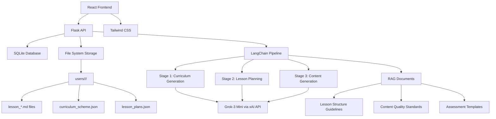
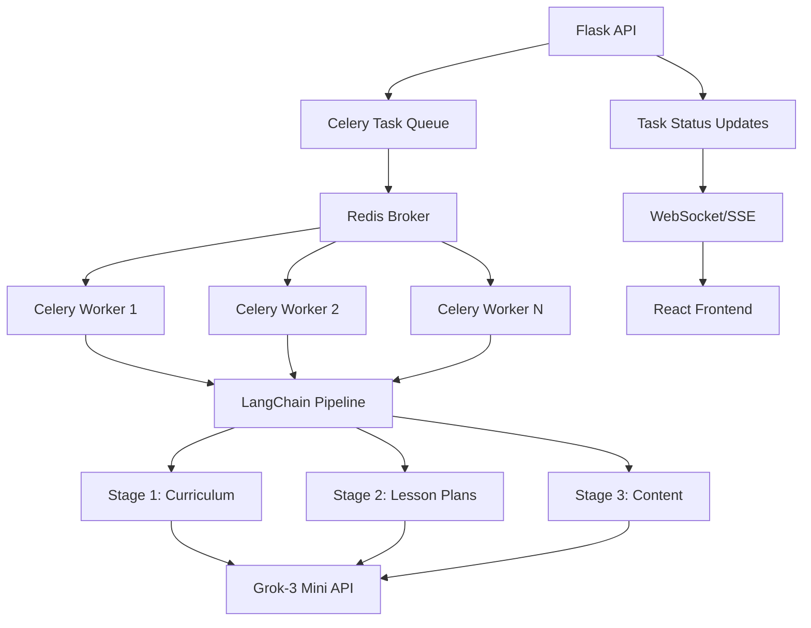
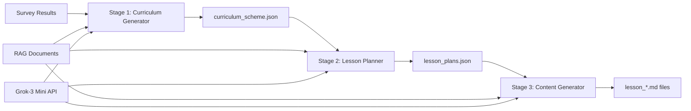
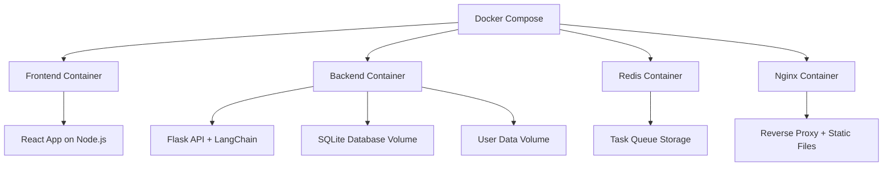

# Design Document

## Overview

The Personalized Learning Path Generator is designed as a full-stack web application with a React frontend and Flask backend, featuring an advanced AI-powered content generation pipeline. The system uses LangChain to orchestrate a three-stage content creation process with Grok-3 Mini via xAI's API, guided by RAG documents for consistent quality. The architecture combines SQLite for structured data, file system storage for lesson content, and a sophisticated AI pipeline for personalized learning material generation.

## Architecture

### High-Level Architecture



### System Components

- **Frontend**: React SPA with Tailwind CSS for responsive UI
- **Backend**: Flask REST API with SQLAlchemy ORM
- **Database**: SQLite for user data, subscriptions, and metadata
- **Storage**: File system for lesson content and user-specific data
- **AI Pipeline**: LangChain-orchestrated three-stage content generation
- **AI Provider**: Grok-3 Mini via xAI API for content generation
- **RAG System**: Document-guided content structure and quality control
- **Task Queue**: Redis + Celery for background processing of LangChain pipeline
- **Task Workers**: Celery workers executing LangChain content generation tasks

## Redis Task Queue Integration

### Task Queue Architecture



### Celery Task Configuration

```python
# celery_config.py
from celery import Celery
import os

def make_celery(app):
    celery = Celery(
        app.import_name,
        backend=os.getenv('CELERY_RESULT_BACKEND', 'redis://redis:6379/0'),
        broker=os.getenv('CELERY_BROKER_URL', 'redis://redis:6379/0')
    )
    
    celery.conf.update(
        task_serializer='json',
        accept_content=['json'],
        result_serializer='json',
        timezone='UTC',
        enable_utc=True,
        task_track_started=True,
        task_routes={
            'content_generation.*': {'queue': 'content_generation'},
            'survey_generation.*': {'queue': 'survey_generation'},
        }
    )
    
    class ContextTask(celery.Task):
        def __call__(self, *args, **kwargs):
            with app.app_context():
                return self.run(*args, **kwargs)
    
    celery.Task = ContextTask
    return celery
```

### LangChain Pipeline Tasks

```python
# tasks/content_generation.py
from celery import current_task
from app.services.langchain_pipeline import (
    CurriculumGeneratorChain,
    LessonPlannerChain, 
    ContentGeneratorChain
)
from app.services.user_data_service import UserDataService
import json

@celery.task(bind=True, name='content_generation.generate_full_course')
def generate_full_course(self, user_id, subject, survey_data):
    """
    Main task that orchestrates the complete 3-stage pipeline
    """
    try:
        # Update task status
        self.update_state(
            state='PROGRESS',
            meta={'stage': 'starting', 'progress': 0, 'total_stages': 3}
        )
        
        # Stage 1: Generate Curriculum
        curriculum_task_id = generate_curriculum.delay(user_id, subject, survey_data)
        curriculum_result = curriculum_task_id.get()
        
        self.update_state(
            state='PROGRESS',
            meta={'stage': 'curriculum_complete', 'progress': 1, 'total_stages': 3}
        )
        
        # Stage 2: Generate Lesson Plans
        lesson_plans_task_id = generate_lesson_plans.delay(
            user_id, subject, curriculum_result
        )
        lesson_plans_result = lesson_plans_task_id.get()
        
        self.update_state(
            state='PROGRESS',
            meta={'stage': 'lesson_plans_complete', 'progress': 2, 'total_stages': 3}
        )
        
        # Stage 3: Generate Content (parallel tasks for each lesson)
        content_tasks = []
        for lesson_plan in lesson_plans_result['lesson_plans']:
            task = generate_lesson_content.delay(
                user_id, subject, lesson_plan
            )
            content_tasks.append(task)
        
        # Wait for all content generation tasks to complete
        lesson_contents = []
        for i, task in enumerate(content_tasks):
            content = task.get()
            lesson_contents.append(content)
            
            # Update progress for each completed lesson
            progress = 2 + (i + 1) / len(content_tasks)
            self.update_state(
                state='PROGRESS',
                meta={
                    'stage': 'content_generation',
                    'progress': progress,
                    'total_stages': 3,
                    'lessons_completed': i + 1,
                    'total_lessons': len(content_tasks)
                }
            )
        
        return {
            'status': 'completed',
            'curriculum': curriculum_result,
            'lesson_plans': lesson_plans_result,
            'lesson_contents': lesson_contents
        }
        
    except Exception as exc:
        self.update_state(
            state='FAILURE',
            meta={'error': str(exc), 'stage': 'failed'}
        )
        raise

@celery.task(bind=True, name='content_generation.generate_curriculum')
def generate_curriculum(self, user_id, subject, survey_data):
    """Stage 1: Generate curriculum scheme"""
    try:
        self.update_state(
            state='PROGRESS',
            meta={'stage': 'curriculum_generation', 'step': 'initializing'}
        )
        
        # Load RAG documents
        rag_docs = load_rag_documents('curriculum')
        
        # Initialize LangChain curriculum generator
        curriculum_chain = CurriculumGeneratorChain()
        
        self.update_state(
            state='PROGRESS',
            meta={'stage': 'curriculum_generation', 'step': 'calling_ai'}
        )
        
        # Generate curriculum using LangChain
        curriculum_data = curriculum_chain.generate_curriculum(
            survey_data=survey_data,
            subject=subject,
            rag_docs=rag_docs
        )
        
        # Save curriculum to file system
        UserDataService.save_curriculum_scheme(user_id, subject, curriculum_data)
        
        return curriculum_data
        
    except Exception as exc:
        self.update_state(
            state='FAILURE',
            meta={'error': str(exc), 'stage': 'curriculum_generation'}
        )
        raise

@celery.task(bind=True, name='content_generation.generate_lesson_plans')
def generate_lesson_plans(self, user_id, subject, curriculum_data):
    """Stage 2: Generate detailed lesson plans"""
    try:
        self.update_state(
            state='PROGRESS',
            meta={'stage': 'lesson_planning', 'step': 'initializing'}
        )
        
        # Load RAG documents
        rag_docs = load_rag_documents('lesson_plans')
        
        # Initialize LangChain lesson planner
        planner_chain = LessonPlannerChain()
        
        self.update_state(
            state='PROGRESS',
            meta={'stage': 'lesson_planning', 'step': 'calling_ai'}
        )
        
        # Generate lesson plans using LangChain
        lesson_plans_data = planner_chain.generate_lesson_plans(
            curriculum_data=curriculum_data,
            subject=subject,
            rag_docs=rag_docs
        )
        
        # Save lesson plans to file system
        UserDataService.save_lesson_plans(user_id, subject, lesson_plans_data)
        
        return lesson_plans_data
        
    except Exception as exc:
        self.update_state(
            state='FAILURE',
            meta={'error': str(exc), 'stage': 'lesson_planning'}
        )
        raise

@celery.task(bind=True, name='content_generation.generate_lesson_content')
def generate_lesson_content(self, user_id, subject, lesson_plan):
    """Stage 3: Generate individual lesson content"""
    try:
        lesson_id = lesson_plan['lesson_id']
        
        self.update_state(
            state='PROGRESS',
            meta={
                'stage': 'content_generation',
                'lesson_id': lesson_id,
                'step': 'initializing'
            }
        )
        
        # Load RAG documents
        rag_docs = load_rag_documents('content')
        
        # Initialize LangChain content generator
        content_chain = ContentGeneratorChain()
        
        self.update_state(
            state='PROGRESS',
            meta={
                'stage': 'content_generation',
                'lesson_id': lesson_id,
                'step': 'calling_ai'
            }
        )
        
        # Generate lesson content using LangChain
        lesson_content = content_chain.generate_content(
            lesson_plan=lesson_plan,
            subject=subject,
            rag_docs=rag_docs
        )
        
        # Save lesson content to file system
        UserDataService.save_lesson_content(
            user_id, subject, lesson_id, lesson_content
        )
        
        return {
            'lesson_id': lesson_id,
            'content': lesson_content,
            'status': 'completed'
        }
        
    except Exception as exc:
        self.update_state(
            state='FAILURE',
            meta={
                'error': str(exc),
                'stage': 'content_generation',
                'lesson_id': lesson_plan.get('lesson_id', 'unknown')
            }
        )
        raise

@celery.task(bind=True, name='survey_generation.generate_survey')
def generate_survey(self, user_id, subject):
    """Generate AI-powered survey questions"""
    try:
        self.update_state(
            state='PROGRESS',
            meta={'stage': 'survey_generation', 'step': 'initializing'}
        )
        
        # Load RAG documents for survey generation
        rag_docs = load_rag_documents('survey')
        
        # Initialize survey generator chain
        survey_chain = SurveyGeneratorChain()
        
        self.update_state(
            state='PROGRESS',
            meta={'stage': 'survey_generation', 'step': 'calling_ai'}
        )
        
        # Generate survey using LangChain
        survey_data = survey_chain.generate_survey(
            subject=subject,
            rag_docs=rag_docs
        )
        
        # Save survey to file system
        UserDataService.save_survey(user_id, subject, survey_data)
        
        return survey_data
        
    except Exception as exc:
        self.update_state(
            state='FAILURE',
            meta={'error': str(exc), 'stage': 'survey_generation'}
        )
        raise
```

### API Integration with Task Queue

```python
# api/content_generation.py
from flask import Blueprint, request, jsonify
from celery.result import AsyncResult
from tasks.content_generation import generate_full_course, generate_survey

content_bp = Blueprint('content', __name__)

@content_bp.route('/users/<user_id>/subjects/<subject>/content/generate', methods=['POST'])
def start_content_generation(user_id, subject):
    """Start the complete content generation pipeline"""
    try:
        # Get survey data
        survey_data = UserDataService.load_survey_answers(user_id, subject)
        if not survey_data:
            return jsonify({'error': 'Survey answers not found'}), 400
        
        # Start the main pipeline task
        task = generate_full_course.delay(user_id, subject, survey_data)
        
        return jsonify({
            'task_id': task.id,
            'status': 'started',
            'message': 'Content generation pipeline started'
        }), 202
        
    except Exception as e:
        return jsonify({'error': str(e)}), 500

@content_bp.route('/users/<user_id>/subjects/<subject>/content/status/<task_id>')
def get_content_generation_status(user_id, subject, task_id):
    """Get the status of content generation pipeline"""
    try:
        task = AsyncResult(task_id)
        
        if task.state == 'PENDING':
            response = {
                'state': task.state,
                'status': 'Task is waiting to be processed'
            }
        elif task.state == 'PROGRESS':
            response = {
                'state': task.state,
                'status': 'Task is in progress',
                **task.info
            }
        elif task.state == 'SUCCESS':
            response = {
                'state': task.state,
                'status': 'Task completed successfully',
                'result': task.result
            }
        else:  # FAILURE
            response = {
                'state': task.state,
                'status': 'Task failed',
                'error': str(task.info)
            }
        
        return jsonify(response)
        
    except Exception as e:
        return jsonify({'error': str(e)}), 500

@content_bp.route('/users/<user_id>/subjects/<subject>/survey/generate', methods=['POST'])
def start_survey_generation(user_id, subject):
    """Start survey generation task"""
    try:
        task = generate_survey.delay(user_id, subject)
        
        return jsonify({
            'task_id': task.id,
            'status': 'started',
            'message': 'Survey generation started'
        }), 202
        
    except Exception as e:
        return jsonify({'error': str(e)}), 500
```

### Frontend Task Status Integration

```javascript
// services/taskService.js
class TaskService {
  static async startContentGeneration(userId, subject) {
    const response = await fetch(
      `/api/users/${userId}/subjects/${subject}/content/generate`,
      { method: 'POST' }
    );
    return response.json();
  }
  
  static async getTaskStatus(userId, subject, taskId) {
    const response = await fetch(
      `/api/users/${userId}/subjects/${subject}/content/status/${taskId}`
    );
    return response.json();
  }
  
  static pollTaskStatus(userId, subject, taskId, onUpdate, onComplete, onError) {
    const poll = async () => {
      try {
        const status = await this.getTaskStatus(userId, subject, taskId);
        
        if (status.state === 'PROGRESS') {
          onUpdate(status);
          setTimeout(poll, 2000); // Poll every 2 seconds
        } else if (status.state === 'SUCCESS') {
          onComplete(status.result);
        } else if (status.state === 'FAILURE') {
          onError(status.error);
        } else {
          setTimeout(poll, 1000); // Poll more frequently for pending tasks
        }
      } catch (error) {
        onError(error.message);
      }
    };
    
    poll();
  }
}

// components/ContentGenerationProgress.js
import React, { useState, useEffect } from 'react';
import TaskService from '../services/taskService';

const ContentGenerationProgress = ({ userId, subject, onComplete }) => {
  const [taskStatus, setTaskStatus] = useState(null);
  const [error, setError] = useState(null);
  
  const startGeneration = async () => {
    try {
      const result = await TaskService.startContentGeneration(userId, subject);
      
      TaskService.pollTaskStatus(
        userId,
        subject,
        result.task_id,
        (status) => setTaskStatus(status), // onUpdate
        (result) => {                      // onComplete
          setTaskStatus({ state: 'SUCCESS', result });
          onComplete(result);
        },
        (error) => setError(error)         // onError
      );
    } catch (err) {
      setError(err.message);
    }
  };
  
  const getProgressPercentage = () => {
    if (!taskStatus || taskStatus.state !== 'PROGRESS') return 0;
    return Math.round((taskStatus.progress / taskStatus.total_stages) * 100);
  };
  
  return (
    <div className="content-generation-progress">
      {!taskStatus && (
        <button onClick={startGeneration} className="btn-primary">
          Generate Learning Content
        </button>
      )}
      
      {taskStatus && taskStatus.state === 'PROGRESS' && (
        <div className="progress-container">
          <div className="progress-bar">
            <div 
              className="progress-fill" 
              style={{ width: `${getProgressPercentage()}%` }}
            />
          </div>
          <p className="progress-text">
            {taskStatus.stage === 'curriculum_generation' && 'Generating curriculum...'}
            {taskStatus.stage === 'lesson_planning' && 'Creating lesson plans...'}
            {taskStatus.stage === 'content_generation' && 
              `Generating lessons (${taskStatus.lessons_completed || 0}/${taskStatus.total_lessons || 10})...`
            }
          </p>
        </div>
      )}
      
      {error && (
        <div className="error-message">
          <p>Error: {error}</p>
          <button onClick={startGeneration} className="btn-secondary">
            Retry
          </button>
        </div>
      )}
    </div>
  );
};
```

## LangChain Content Generation Pipeline

### Three-Stage Pipeline Architecture



### Stage 1: Curriculum Generation
**Purpose**: Generate a comprehensive learning scheme based on survey results
**Input**: Survey answers, user skill level, subject selection
**Output**: `curriculum_scheme.json` with lesson topics, progression, and learning objectives
**RAG Guidance**: Curriculum structure templates, learning progression guidelines

```python
import os
from langchain_community.llms import ChatGroq

class CurriculumGeneratorChain:
    def __init__(self):
        # Load xAI API configuration from environment
        api_key = os.getenv('XAI_API_KEY')
        api_url = os.getenv('GROK_API_URL')
        
        if not api_key or not api_url:
            raise ValueError("XAI_API_KEY and GROK_API_URL must be set in environment")
            
        self.llm = ChatGroq(
            model="grok-3-mini",
            api_key=api_key,
            base_url=api_url
        )
        self.prompt_template = PromptTemplate.from_template(
            "Based on survey results: {survey_results}\n"
            "Generate a 10-lesson curriculum for {subject} at {skill_level} level.\n"
            "Follow these guidelines: {rag_guidelines}\n"
            "Skip topics the user already knows: {known_topics}"
        )
        
    def generate_curriculum(self, survey_data, rag_docs):
        # LangChain implementation
        pass
```

### Stage 2: Lesson Planning
**Purpose**: Create detailed lesson plans for each curriculum topic
**Input**: Curriculum scheme, subject, skill level
**Output**: `lesson_plans.json` with detailed lesson structures, objectives, and activities
**RAG Guidance**: Lesson plan templates, learning objective formats, activity types

```python
class LessonPlannerChain:
    def __init__(self):
        # Load xAI API configuration from environment
        api_key = os.getenv('XAI_API_KEY')
        api_url = os.getenv('GROK_API_URL')
        
        self.llm = ChatGroq(
            model="grok-3-mini",
            api_key=api_key,
            base_url=api_url
        )
        self.prompt_template = PromptTemplate.from_template(
            "Create detailed lesson plans for: {curriculum_topics}\n"
            "Subject: {subject}, Level: {skill_level}\n"
            "Follow lesson structure: {rag_structure}\n"
            "Include objectives, activities, and assessments"
        )
        
    def generate_lesson_plans(self, curriculum_data, rag_docs):
        # LangChain implementation
        pass
```

### Stage 3: Content Generation
**Purpose**: Generate complete lesson content with explanations, examples, and exercises
**Input**: Lesson plans, subject, skill level
**Output**: Individual `lesson_*.md` files with complete lesson content
**RAG Guidance**: Content formatting standards, example quality criteria, exercise templates

```python
class ContentGeneratorChain:
    def __init__(self):
        # Load xAI API configuration from environment
        api_key = os.getenv('XAI_API_KEY')
        api_url = os.getenv('GROK_API_URL')
        
        self.llm = ChatGroq(
            model="grok-3-mini",
            api_key=api_key,
            base_url=api_url
        )
        self.prompt_template = PromptTemplate.from_template(
            "Generate complete lesson content for: {lesson_plan}\n"
            "Include: explanations, 2 code examples, 3 exercises\n"
            "Follow content standards: {rag_standards}\n"
            "Format as markdown with proper structure"
        )
        
    def generate_content(self, lesson_plan_data, rag_docs):
        # LangChain implementation
        pass
```

### RAG Document Structure

#### Content Guidelines (`rag_docs/content_guidelines.md`)
- Lesson structure templates
- Code example quality standards
- Exercise difficulty progression
- Assessment criteria

#### Subject-Specific Templates (`rag_docs/{subject}_templates.md`)
- Subject-specific terminology
- Common examples and use cases
- Typical learning progression
- Key concepts and skills

#### Quality Standards (`rag_docs/quality_standards.md`)
- Content accuracy requirements
- Accessibility guidelines
- Engagement best practices
- Technical depth guidelines

## Components and Interfaces

### Frontend Components

#### Core Components
- `App.js` - Main application component with routing
- `SubjectSelector.js` - Subject selection interface
- `Survey.js` - Dynamic survey component
- `LessonViewer.js` - Markdown lesson renderer
- `PaymentGate.js` - Subscription management interface
- `ResponsiveLayout.js` - Layout wrapper for responsive design

#### Responsive Design System
```javascript
// Tailwind breakpoints
const breakpoints = {
  mobile: 'max-width: 767px',
  tablet: 'min-width: 768px',
  desktop: 'min-width: 1024px'
}

// Layout configurations
const layouts = {
  desktop: 'sidebar + main content',
  tablet: 'stacked with larger touch targets',
  mobile: 'single column, touch-friendly'
}
```

### Backend API Endpoints

#### User Management
- `POST /api/users` - Create new user
- `GET /api/users/<user_id>` - Get user profile
- `PUT /api/users/<user_id>` - Update user profile

#### Subject Management
- `GET /api/subjects` - List available subjects
- `POST /api/users/<user_id>/subjects/<subject>/select` - Select subject
- `GET /api/users/<user_id>/subjects/<subject>/status` - Check subscription status

#### Survey System
- `POST /api/users/<user_id>/subjects/<subject>/survey/generate` - Generate AI survey via LangChain
- `GET /api/users/<user_id>/subjects/<subject>/survey` - Get survey questions
- `POST /api/users/<user_id>/subjects/<subject>/survey/submit` - Submit answers
- `GET /api/users/<user_id>/subjects/<subject>/survey/results` - Get analysis results

#### Content Generation Pipeline
- `POST /api/users/<user_id>/subjects/<subject>/content/generate` - Start LangChain pipeline
- `GET /api/users/<user_id>/subjects/<subject>/content/status` - Get generation progress
- `POST /api/users/<user_id>/subjects/<subject>/curriculum/generate` - Stage 1: Generate curriculum
- `POST /api/users/<user_id>/subjects/<subject>/lesson-plans/generate` - Stage 2: Generate lesson plans
- `POST /api/users/<user_id>/subjects/<subject>/lessons/generate` - Stage 3: Generate lesson content

#### Lesson Management
- `GET /api/users/<user_id>/subjects/<subject>/curriculum` - Get curriculum scheme
- `GET /api/users/<user_id>/subjects/<subject>/lesson-plans` - Get lesson plans
- `GET /api/users/<user_id>/subjects/<subject>/lessons` - List lessons
- `GET /api/users/<user_id>/subjects/<subject>/lessons/<lesson_id>` - Get lesson content

#### RAG Document Management
- `GET /api/rag-docs` - List available RAG documents
- `GET /api/rag-docs/<doc_type>` - Get specific RAG document
- `PUT /api/rag-docs/<doc_type>` - Update RAG document (admin only)

#### Subscription Management
- `GET /api/users/<user_id>/subscriptions` - List user subscriptions
- `POST /api/users/<user_id>/subscriptions/<subject>` - Purchase subject access
- `DELETE /api/users/<user_id>/subscriptions/<subject>` - Cancel subscription

## Data Models

### Database Schema

#### Users Table
```sql
CREATE TABLE users (
    id INTEGER PRIMARY KEY AUTOINCREMENT,
    user_id VARCHAR(50) UNIQUE NOT NULL,
    email VARCHAR(100),
    created_at TIMESTAMP DEFAULT CURRENT_TIMESTAMP,
    updated_at TIMESTAMP DEFAULT CURRENT_TIMESTAMP
);
```

#### Subscriptions Table
```sql
CREATE TABLE subscriptions (
    id INTEGER PRIMARY KEY AUTOINCREMENT,
    user_id VARCHAR(50) NOT NULL,
    subject VARCHAR(50) NOT NULL,
    status VARCHAR(20) DEFAULT 'active',
    purchased_at TIMESTAMP DEFAULT CURRENT_TIMESTAMP,
    expires_at TIMESTAMP,
    FOREIGN KEY (user_id) REFERENCES users(user_id),
    UNIQUE(user_id, subject)
);
```

#### Survey Results Table
```sql
CREATE TABLE survey_results (
    id INTEGER PRIMARY KEY AUTOINCREMENT,
    user_id VARCHAR(50) NOT NULL,
    subject VARCHAR(50) NOT NULL,
    skill_level VARCHAR(20),
    completed_at TIMESTAMP DEFAULT CURRENT_TIMESTAMP,
    FOREIGN KEY (user_id) REFERENCES users(user_id)
);
```

### File System Data Models

#### Selection Data (`users/<user_id>/selection.json`)
```json
{
  "selected_subject": "python",
  "selected_at": "2024-01-15T10:30:00Z"
}
```

#### Survey Data (`users/<user_id>/<subject>/survey.json`)
```json
{
  "questions": [
    {
      "id": 1,
      "question": "What is a Python list?",
      "type": "multiple_choice",
      "options": ["A", "B", "C", "D"],
      "difficulty": "beginner"
    }
  ],
  "generated_at": "2024-01-15T10:35:00Z"
}
```

#### Survey Answers (`users/<user_id>/<subject>/survey_answers.json`)
```json
{
  "answers": [
    {
      "question_id": 1,
      "answer": "C",
      "correct": true
    }
  ],
  "submitted_at": "2024-01-15T10:45:00Z",
  "skill_level": "intermediate"
}
```

#### Curriculum Scheme (`users/<user_id>/<subject>/curriculum_scheme.json`)
```json
{
  "curriculum": {
    "subject": "python",
    "skill_level": "intermediate",
    "total_lessons": 10,
    "learning_objectives": ["Master Python fundamentals", "Build practical projects"],
    "topics": [
      {
        "lesson_id": 1,
        "title": "Advanced Variables and Data Types",
        "topics": ["dictionaries", "sets", "type_hints"],
        "prerequisites": [],
        "difficulty": "intermediate"
      }
    ]
  },
  "generated_at": "2024-01-15T11:00:00Z",
  "generation_stage": "curriculum_complete"
}
```

#### Lesson Plans (`users/<user_id>/<subject>/lesson_plans.json`)
```json
{
  "lesson_plans": [
    {
      "lesson_id": 1,
      "title": "Advanced Variables and Data Types",
      "learning_objectives": ["Understand complex data structures", "Apply type hints"],
      "structure": {
        "introduction": "5 minutes",
        "main_content": "20 minutes",
        "examples": "10 minutes",
        "exercises": "15 minutes"
      },
      "activities": [
        "Interactive dictionary manipulation",
        "Type hint implementation exercise"
      ],
      "assessment": "3 coding challenges"
    }
  ],
  "generated_at": "2024-01-15T11:05:00Z",
  "generation_stage": "lesson_plans_complete"
}
```

#### Generation Status (`users/<user_id>/<subject>/generation_status.json`)
```json
{
  "pipeline_status": "in_progress",
  "current_stage": "content_generation",
  "stages": {
    "curriculum_generation": {
      "status": "completed",
      "completed_at": "2024-01-15T11:00:00Z"
    },
    "lesson_planning": {
      "status": "completed", 
      "completed_at": "2024-01-15T11:05:00Z"
    },
    "content_generation": {
      "status": "in_progress",
      "progress": "3/10 lessons completed",
      "started_at": "2024-01-15T11:10:00Z"
    }
  }
}
```

## Error Handling

### Frontend Error Handling
- **Network Errors**: Display user-friendly messages with retry options
- **Validation Errors**: Real-time form validation with clear error messages
- **Authentication Errors**: Redirect to login with appropriate messaging
- **Payment Errors**: Clear payment failure messages with support contact

### Backend Error Handling
- **File System Errors**: Graceful handling of missing directories/files
- **Database Errors**: Transaction rollback and error logging
- **Content Generation Errors**: Fallback to default content templates
- **Subscription Validation**: Clear messaging for expired/invalid subscriptions

### Error Response Format
```json
{
  "error": {
    "code": "SUBSCRIPTION_REQUIRED",
    "message": "Active subscription required for this subject",
    "details": {
      "subject": "python",
      "available_plans": ["monthly", "yearly"]
    }
  }
}
```

## Testing Strategy

### Frontend Testing
- **Unit Tests**: Jest and React Testing Library for component testing
- **Integration Tests**: API integration testing with mock backend
- **Responsive Tests**: Automated testing across different viewport sizes
- **Accessibility Tests**: axe-core integration for a11y compliance
- **E2E Tests**: Cypress for complete user journey testing

### Backend Testing
- **Unit Tests**: pytest for individual function testing
- **API Tests**: Flask test client for endpoint testing
- **Database Tests**: SQLite in-memory database for isolated testing
- **File System Tests**: Temporary directories for storage testing
- **Integration Tests**: Full stack testing with test database

### Test Coverage Requirements
- Minimum 80% code coverage for both frontend and backend
- 100% coverage for critical payment and subscription logic
- Comprehensive testing of responsive design breakpoints
- Accessibility compliance testing for WCAG 2.1 AA standards

### Content Generation Testing
- **Survey Generation**: Validate question quality and difficulty distribution
- **Lesson Generation**: Ensure content relevance and skill level appropriateness
- **Personalization**: Test that lessons skip known topics correctly
- **Content Quality**: Manual review process for generated content accuracy

## Environment Configuration

### Required Environment Variables

The system requires the following environment variables to be configured:

```bash
# xAI API Configuration
XAI_API_KEY=your_xai_api_key_here
GROK_API_URL=https://api.x.ai/v1

# Database Configuration
DATABASE_URL=sqlite:///mindcoach.db

# Flask Configuration
FLASK_ENV=development
SECRET_KEY=your_secret_key_here

# Optional: Redis for task queue (if using background processing)
REDIS_URL=redis://localhost:6379/0
```

### Environment File Structure

Create a `.env` file in the backend directory:

```
# .env file for MindCoach backend
XAI_API_KEY=xai-your-actual-api-key-here
GROK_API_URL=https://api.x.ai/v1
DATABASE_URL=sqlite:///instance/mindcoach.db
FLASK_ENV=development
SECRET_KEY=dev-secret-key-change-in-production
REDIS_URL=redis://localhost:6379/0
```

### Loading Environment Variables

```python
# config.py
import os
from dotenv import load_dotenv

load_dotenv()

class Config:
    XAI_API_KEY = os.getenv('XAI_API_KEY')
    GROK_API_URL = os.getenv('GROK_API_URL')
    DATABASE_URL = os.getenv('DATABASE_URL', 'sqlite:///mindcoach.db')
    SECRET_KEY = os.getenv('SECRET_KEY', 'dev-secret-key')
    REDIS_URL = os.getenv('REDIS_URL', 'redis://localhost:6379/0')
    
    @staticmethod
    def validate_config():
        required_vars = ['XAI_API_KEY', 'GROK_API_URL']
        missing_vars = [var for var in required_vars if not os.getenv(var)]
        
        if missing_vars:
            raise ValueError(f"Missing required environment variables: {', '.join(missing_vars)}")
```

## Security Considerations

### Authentication & Authorization
- JWT-based authentication for API access
- Role-based access control for admin functions
- Secure session management with proper expiration

### Data Protection
- Input validation and sanitization for all user inputs
- SQL injection prevention through parameterized queries
- XSS protection through proper output encoding
- File path validation to prevent directory traversal

### Payment Security
- PCI DSS compliance for payment processing
- Secure API key management for payment providers
- Encrypted storage of sensitive subscription data

## Docker Containerization

### Container Architecture



### Dockerfile Configurations

#### Frontend Dockerfile
```dockerfile
FROM node:18-alpine AS builder

WORKDIR /app
COPY package*.json ./
RUN npm ci --only=production

COPY . .
RUN npm run build

FROM nginx:alpine
COPY --from=builder /app/build /usr/share/nginx/html
COPY nginx.conf /etc/nginx/nginx.conf
EXPOSE 80
CMD ["nginx", "-g", "daemon off;"]
```

#### Backend Dockerfile
```dockerfile
FROM python:3.11-slim

WORKDIR /app

# Install system dependencies
RUN apt-get update && apt-get install -y \
    gcc \
    && rm -rf /var/lib/apt/lists/*

# Install Python dependencies
COPY requirements.txt .
RUN pip install --no-cache-dir -r requirements.txt

# Copy application code
COPY . .

# Create directories for data storage
RUN mkdir -p /app/instance /app/users /app/rag_docs

# Set environment variables
ENV FLASK_APP=run.py
ENV PYTHONPATH=/app

EXPOSE 5000

CMD ["gunicorn", "--bind", "0.0.0.0:5000", "--workers", "4", "run:app"]
```

### Docker Compose Configuration

```yaml
version: '3.8'

services:
  frontend:
    build:
      context: ./frontend
      dockerfile: Dockerfile
    ports:
      - "3000:80"
    depends_on:
      - backend
    environment:
      - REACT_APP_API_URL=http://localhost:5000

  backend:
    build:
      context: ./backend
      dockerfile: Dockerfile
    ports:
      - "5000:5000"
    depends_on:
      - redis
    environment:
      - XAI_API_KEY=${XAI_API_KEY}
      - GROK_API_URL=${GROK_API_URL}
      - DATABASE_URL=sqlite:///instance/mindcoach.db
      - CELERY_BROKER_URL=redis://redis:6379/0
      - CELERY_RESULT_BACKEND=redis://redis:6379/0
      - FLASK_ENV=production
    volumes:
      - backend_data:/app/instance
      - user_data:/app/users
      - rag_docs:/app/rag_docs
    restart: unless-stopped

  celery_worker:
    build:
      context: ./backend
      dockerfile: Dockerfile
    depends_on:
      - redis
      - backend
    environment:
      - XAI_API_KEY=${XAI_API_KEY}
      - GROK_API_URL=${GROK_API_URL}
      - DATABASE_URL=sqlite:///instance/mindcoach.db
      - CELERY_BROKER_URL=redis://redis:6379/0
      - CELERY_RESULT_BACKEND=redis://redis:6379/0
    volumes:
      - backend_data:/app/instance
      - user_data:/app/users
      - rag_docs:/app/rag_docs
    command: ["celery", "-A", "app.celery", "worker", "--loglevel=info", "--concurrency=2"]
    restart: unless-stopped

  celery_beat:
    build:
      context: ./backend
      dockerfile: Dockerfile
    depends_on:
      - redis
      - backend
    environment:
      - CELERY_BROKER_URL=redis://redis:6379/0
      - CELERY_RESULT_BACKEND=redis://redis:6379/0
    volumes:
      - backend_data:/app/instance
    command: ["celery", "-A", "app.celery", "beat", "--loglevel=info"]
    restart: unless-stopped

  redis:
    image: redis:7-alpine
    ports:
      - "6379:6379"
    volumes:
      - redis_data:/data
    restart: unless-stopped

  nginx:
    image: nginx:alpine
    ports:
      - "80:80"
      - "443:443"
    volumes:
      - ./nginx/nginx.conf:/etc/nginx/nginx.conf
      - ./nginx/ssl:/etc/nginx/ssl
    depends_on:
      - frontend
      - backend
    restart: unless-stopped

volumes:
  backend_data:
  user_data:
  rag_docs:
  redis_data:
```

### Development vs Production Configurations

#### Development (docker-compose.dev.yml)
```yaml
version: '3.8'

services:
  frontend:
    build:
      context: ./frontend
      dockerfile: Dockerfile.dev
    ports:
      - "3000:3000"
    volumes:
      - ./frontend:/app
      - /app/node_modules
    environment:
      - REACT_APP_API_URL=http://localhost:5000
      - CHOKIDAR_USEPOLLING=true

  backend:
    build:
      context: ./backend
      dockerfile: Dockerfile.dev
    ports:
      - "5000:5000"
    volumes:
      - ./backend:/app
      - backend_data:/app/instance
      - user_data:/app/users
    environment:
      - FLASK_ENV=development
      - FLASK_DEBUG=1
    command: ["flask", "run", "--host=0.0.0.0", "--port=5000", "--reload"]
```

### Container Health Checks

```dockerfile
# Backend Dockerfile health check
HEALTHCHECK --interval=30s --timeout=10s --start-period=5s --retries=3 \
  CMD curl -f http://localhost:5000/health || exit 1
```

```python
# Backend health endpoint
@app.route('/health')
def health_check():
    try:
        # Check database connection
        db.session.execute('SELECT 1')
        
        # Check Redis connection
        redis_client.ping()
        
        # Check xAI API availability (optional)
        # api_status = check_xai_api()
        
        return jsonify({
            'status': 'healthy',
            'timestamp': datetime.utcnow().isoformat(),
            'services': {
                'database': 'up',
                'redis': 'up',
                'xai_api': 'up'
            }
        }), 200
    except Exception as e:
        return jsonify({
            'status': 'unhealthy',
            'error': str(e)
        }), 503
```

## Performance Optimization

### Frontend Performance
- Code splitting for reduced initial bundle size
- Lazy loading of lesson content
- Responsive image optimization
- Service worker for offline lesson access

### Backend Performance
- Database indexing for user and subscription queries
- Caching of generated content
- Async processing for lesson generation
- Rate limiting for API endpoints

### Content Delivery
- CDN integration for static assets
- Gzip compression for API responses
- Efficient markdown parsing and rendering
- Progressive loading of lesson sequences

### Container Performance
- Multi-stage builds for smaller image sizes
- Alpine Linux base images for reduced footprint
- Proper resource limits and health checks
- Horizontal scaling with Docker Swarm or Kubernetes