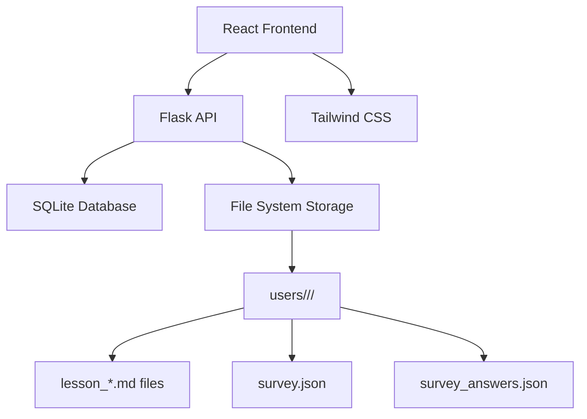

# Design Document

## Overview

The Personalized Learning Path Generator is designed as a full-stack web application with a React frontend and Flask backend. The system uses a hybrid storage approach: SQLite for structured data (users, subscriptions, survey results) and file system storage for lesson content. The architecture emphasizes responsive design, accessibility, and scalable content generation.

## Architecture

### High-Level Architecture



### System Components

- **Frontend**: React SPA with Tailwind CSS for responsive UI
- **Backend**: Flask REST API with SQLAlchemy ORM
- **Database**: SQLite for user data, subscriptions, and metadata
- **Storage**: File system for lesson content and user-specific data
- **Content Generation**: AI-powered lesson and survey generation

## Components and Interfaces

### Frontend Components

#### Core Components
- `App.js` - Main application component with routing
- `SubjectSelector.js` - Subject selection interface
- `Survey.js` - Dynamic survey component
- `LessonViewer.js` - Markdown lesson renderer
- `PaymentGate.js` - Subscription management interface
- `ResponsiveLayout.js` - Layout wrapper for responsive design

#### Responsive Design System
```javascript
// Tailwind breakpoints
const breakpoints = {
  mobile: 'max-width: 767px',
  tablet: 'min-width: 768px',
  desktop: 'min-width: 1024px'
}

// Layout configurations
const layouts = {
  desktop: 'sidebar + main content',
  tablet: 'stacked with larger touch targets',
  mobile: 'single column, touch-friendly'
}
```

### Backend API Endpoints

#### User Management
- `POST /api/users` - Create new user
- `GET /api/users/<user_id>` - Get user profile
- `PUT /api/users/<user_id>` - Update user profile

#### Subject Management
- `GET /api/subjects` - List available subjects
- `POST /api/users/<user_id>/subjects/<subject>/select` - Select subject
- `GET /api/users/<user_id>/subjects/<subject>/status` - Check subscription status

#### Survey System
- `POST /api/users/<user_id>/subjects/<subject>/survey/generate` - Generate survey
- `GET /api/users/<user_id>/subjects/<subject>/survey` - Get survey questions
- `POST /api/users/<user_id>/subjects/<subject>/survey/submit` - Submit answers
- `GET /api/users/<user_id>/subjects/<subject>/survey/results` - Get analysis results

#### Lesson Management
- `POST /api/users/<user_id>/subjects/<subject>/lessons/generate` - Generate lessons
- `GET /api/users/<user_id>/subjects/<subject>/lessons` - List lessons
- `GET /api/users/<user_id>/subjects/<subject>/lessons/<lesson_id>` - Get lesson content

#### Subscription Management
- `GET /api/users/<user_id>/subscriptions` - List user subscriptions
- `POST /api/users/<user_id>/subscriptions/<subject>` - Purchase subject access
- `DELETE /api/users/<user_id>/subscriptions/<subject>` - Cancel subscription

## Data Models

### Database Schema

#### Users Table
```sql
CREATE TABLE users (
    id INTEGER PRIMARY KEY AUTOINCREMENT,
    user_id VARCHAR(50) UNIQUE NOT NULL,
    email VARCHAR(100),
    created_at TIMESTAMP DEFAULT CURRENT_TIMESTAMP,
    updated_at TIMESTAMP DEFAULT CURRENT_TIMESTAMP
);
```

#### Subscriptions Table
```sql
CREATE TABLE subscriptions (
    id INTEGER PRIMARY KEY AUTOINCREMENT,
    user_id VARCHAR(50) NOT NULL,
    subject VARCHAR(50) NOT NULL,
    status VARCHAR(20) DEFAULT 'active',
    purchased_at TIMESTAMP DEFAULT CURRENT_TIMESTAMP,
    expires_at TIMESTAMP,
    FOREIGN KEY (user_id) REFERENCES users(user_id),
    UNIQUE(user_id, subject)
);
```

#### Survey Results Table
```sql
CREATE TABLE survey_results (
    id INTEGER PRIMARY KEY AUTOINCREMENT,
    user_id VARCHAR(50) NOT NULL,
    subject VARCHAR(50) NOT NULL,
    skill_level VARCHAR(20),
    completed_at TIMESTAMP DEFAULT CURRENT_TIMESTAMP,
    FOREIGN KEY (user_id) REFERENCES users(user_id)
);
```

### File System Data Models

#### Selection Data (`users/<user_id>/selection.json`)
```json
{
  "selected_subject": "python",
  "selected_at": "2024-01-15T10:30:00Z"
}
```

#### Survey Data (`users/<user_id>/<subject>/survey.json`)
```json
{
  "questions": [
    {
      "id": 1,
      "question": "What is a Python list?",
      "type": "multiple_choice",
      "options": ["A", "B", "C", "D"],
      "difficulty": "beginner"
    }
  ],
  "generated_at": "2024-01-15T10:35:00Z"
}
```

#### Survey Answers (`users/<user_id>/<subject>/survey_answers.json`)
```json
{
  "answers": [
    {
      "question_id": 1,
      "answer": "C",
      "correct": true
    }
  ],
  "submitted_at": "2024-01-15T10:45:00Z",
  "skill_level": "intermediate"
}
```

#### Lesson Metadata (`users/<user_id>/<subject>/lesson_metadata.json`)
```json
{
  "lessons": [
    {
      "id": 1,
      "title": "Python Basics",
      "difficulty": "beginner",
      "topics": ["variables", "data_types"],
      "estimated_time": "30 minutes"
    }
  ],
  "generated_at": "2024-01-15T11:00:00Z",
  "skill_level": "intermediate"
}
```

## Error Handling

### Frontend Error Handling
- **Network Errors**: Display user-friendly messages with retry options
- **Validation Errors**: Real-time form validation with clear error messages
- **Authentication Errors**: Redirect to login with appropriate messaging
- **Payment Errors**: Clear payment failure messages with support contact

### Backend Error Handling
- **File System Errors**: Graceful handling of missing directories/files
- **Database Errors**: Transaction rollback and error logging
- **Content Generation Errors**: Fallback to default content templates
- **Subscription Validation**: Clear messaging for expired/invalid subscriptions

### Error Response Format
```json
{
  "error": {
    "code": "SUBSCRIPTION_REQUIRED",
    "message": "Active subscription required for this subject",
    "details": {
      "subject": "python",
      "available_plans": ["monthly", "yearly"]
    }
  }
}
```

## Testing Strategy

### Frontend Testing
- **Unit Tests**: Jest and React Testing Library for component testing
- **Integration Tests**: API integration testing with mock backend
- **Responsive Tests**: Automated testing across different viewport sizes
- **Accessibility Tests**: axe-core integration for a11y compliance
- **E2E Tests**: Cypress for complete user journey testing

### Backend Testing
- **Unit Tests**: pytest for individual function testing
- **API Tests**: Flask test client for endpoint testing
- **Database Tests**: SQLite in-memory database for isolated testing
- **File System Tests**: Temporary directories for storage testing
- **Integration Tests**: Full stack testing with test database

### Test Coverage Requirements
- Minimum 80% code coverage for both frontend and backend
- 100% coverage for critical payment and subscription logic
- Comprehensive testing of responsive design breakpoints
- Accessibility compliance testing for WCAG 2.1 AA standards

### Content Generation Testing
- **Survey Generation**: Validate question quality and difficulty distribution
- **Lesson Generation**: Ensure content relevance and skill level appropriateness
- **Personalization**: Test that lessons skip known topics correctly
- **Content Quality**: Manual review process for generated content accuracy

## Security Considerations

### Authentication & Authorization
- JWT-based authentication for API access
- Role-based access control for admin functions
- Secure session management with proper expiration

### Data Protection
- Input validation and sanitization for all user inputs
- SQL injection prevention through parameterized queries
- XSS protection through proper output encoding
- File path validation to prevent directory traversal

### Payment Security
- PCI DSS compliance for payment processing
- Secure API key management for payment providers
- Encrypted storage of sensitive subscription data

## Performance Optimization

### Frontend Performance
- Code splitting for reduced initial bundle size
- Lazy loading of lesson content
- Responsive image optimization
- Service worker for offline lesson access

### Backend Performance
- Database indexing for user and subscription queries
- Caching of generated content
- Async processing for lesson generation
- Rate limiting for API endpoints

### Content Delivery
- CDN integration for static assets
- Gzip compression for API responses
- Efficient markdown parsing and rendering
- Progressive loading of lesson sequences