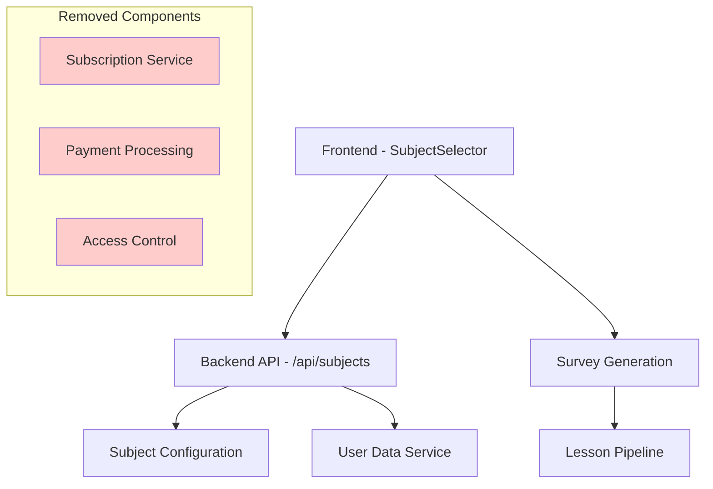

# Design Document

## Overview

The Universal Subject Access design removes all subscription-related complexity from the MindCoach application, transforming it into a simple proof of concept where all subjects are freely accessible. This design eliminates payment gates, subscription checks, and access restrictions while maintaining the core learning functionality of subject selection, surveys, and lesson generation.

## Architecture

### High-Level Architecture Changes

The system architecture remains largely the same but with significant simplifications:



### Component Modifications

1. **Backend API Layer**: Remove subscription validation and payment gates
2. **Frontend Components**: Simplify UI by removing lock indicators and payment flows
3. **Data Layer**: Remove subscription-related database queries and checks
4. **Service Layer**: Eliminate subscription service dependencies

## Components and Interfaces

### Backend API Changes

#### Subjects API (`/api/subjects`)

**Current State**: Complex subscription checking with locked/unlocked states
**Target State**: Simple subject listing with universal access

```python
# Simplified subject response format
{
    "subjects": [
        {
            "id": "python",
            "name": "Python Programming", 
            "description": "Learn Python from basics to advanced concepts",
            "available": true,
            "type": "predefined"
        },
        {
            "id": "therapy",
            "name": "Therapy",
            "description": "Mental health and therapeutic techniques",
            "available": true,
            "type": "predefined"
        }
    ],
    "total_count": 2
}
```

**Key Changes**:
- Remove `locked` field from subject responses
- Remove `pricing` information
- Remove subscription status checking logic
- Remove payment-related endpoints (`/access`, `/status`, `/select`)
- Add therapy to `AVAILABLE_SUBJECTS` configuration

#### Subject Selection Flow

**Current State**: Multi-step validation with subscription checks
**Target State**: Direct selection without barriers

```python
# Simplified selection flow
def handle_subject_selection(user_id, subject):
    # 1. Validate subject exists
    # 2. Save selection directly
    # 3. Proceed to survey generation
    # No subscription checks
```

### Frontend Component Changes

#### SubjectSelector Component

**Current State**: Complex UI with lock indicators and subscription messaging
**Target State**: Clean, uniform subject cards

**Key Changes**:
- Remove subscription status indicators
- Remove payment-related UI elements  
- Simplify subject card styling (all subjects look identical)
- Remove subscription checking logic
- Direct navigation to survey on selection

```javascript
// Simplified SubjectCard component
const SubjectCard = ({ subject, isSelected, onClick }) => {
    return (
        <div className="subject-card" onClick={() => onClick(subject)}>
            <h3>{subject.name}</h3>
            <p>{subject.description}</p>
            <span className="available-badge">Available</span>
        </div>
    );
};
```

### Service Layer Modifications

#### Remove Subscription Service Dependencies

**Files to Modify**:
- `backend/app/api/subjects.py` - Remove SubscriptionService imports and calls
- `frontend/src/components/SubjectSelector.js` - Remove subscription-related state and logic

**Key Changes**:
- Remove all `SubscriptionService.has_active_subscription()` calls
- Remove subscription status checking in API responses
- Remove payment gate logic from subject selection endpoints
- Remove subscription-related error handling

## Data Models

### Subject Configuration Updates

**Add Therapy Subject**:
```python
AVAILABLE_SUBJECTS = {
    'python': {
        'name': 'Python Programming',
        'description': 'Learn Python from basics to advanced concepts'
    },
    'javascript': {
        'name': 'JavaScript Development', 
        'description': 'Master JavaScript for web development'
    },
    'react': {
        'name': 'React Framework',
        'description': 'Build modern web applications with React'
    },
    'nodejs': {
        'name': 'Node.js Backend',
        'description': 'Server-side development with Node.js'
    },
    'sql': {
        'name': 'SQL Database',
        'description': 'Database design and SQL queries'
    },
    'therapy': {
        'name': 'Therapy',
        'description': 'Mental health and therapeutic techniques'
    }
}
```

**Removed Fields**:
- `price_monthly`
- `price_yearly`
- `locked` status
- `subscription` information

### API Response Simplification

**Before**:
```json
{
    "id": "python",
    "name": "Python Programming",
    "description": "Learn Python from basics to advanced concepts",
    "pricing": {
        "monthly": 29.99,
        "yearly": 299.99
    },
    "available": true,
    "locked": true,
    "type": "predefined"
}
```

**After**:
```json
{
    "id": "python", 
    "name": "Python Programming",
    "description": "Learn Python from basics to advanced concepts",
    "available": true,
    "type": "predefined"
}
```

## Error Handling

### Simplified Error Scenarios

**Removed Error Cases**:
- `SUBSCRIPTION_REQUIRED` (402 Payment Required)
- `SUBSCRIPTION_EXPIRED` 
- `PAYMENT_FAILED`
- Subscription validation errors

**Remaining Error Cases**:
- `SUBJECT_NOT_FOUND` (404)
- `INVALID_USER_ID` (400)
- `INVALID_SUBJECT` (400)
- `INTERNAL_ERROR` (500)

### Error Response Format

All error responses maintain the existing format but remove subscription-related error codes:

```json
{
    "error": {
        "code": "SUBJECT_NOT_FOUND",
        "message": "Subject not found"
    }
}
```

## Testing Strategy

### Backend API Testing

**Test Cases to Update**:
1. **Subject Listing**: Verify all subjects return with `available: true`
2. **Subject Selection**: Verify direct access without subscription checks
3. **Therapy Subject**: Verify therapy appears in subject list
4. **New Subject Addition**: Verify automatic inclusion in listings

**Test Cases to Remove**:
1. Subscription validation tests
2. Payment gate enforcement tests  
3. Access control tests
4. Subscription status checking tests

### Frontend Component Testing

**Test Cases to Update**:
1. **Subject Display**: Verify all subjects render identically
2. **Subject Selection**: Verify direct navigation to survey
3. **UI Consistency**: Verify no lock icons or payment indicators
4. **Accessibility**: Verify consistent interaction patterns

**Test Cases to Remove**:
1. Subscription status indicator tests
2. Payment flow tests
3. Lock/unlock state tests
4. Subscription error handling tests

### Integration Testing

**Test Scenarios**:
1. **End-to-End Flow**: User selects any subject → proceeds to survey → generates lessons
2. **Subject Addition**: New subject added → appears immediately in UI
3. **Cross-Subject Access**: User can switch between subjects freely
4. **Anonymous Access**: Non-authenticated users can access all subjects

## Performance Considerations

### Improvements from Simplification

1. **Reduced API Calls**: No subscription status checking reduces backend load
2. **Simplified Queries**: No database joins for subscription data
3. **Faster UI Rendering**: No conditional styling based on subscription status
4. **Reduced Bundle Size**: Remove subscription-related code and dependencies

### Caching Strategy

**Subject List Caching**:
- Cache subject list in frontend state
- Refresh only when new subjects are added
- No need for user-specific caching (all users see same data)

## Security Considerations

### Simplified Security Model

**Removed Security Layers**:
- Subscription validation
- Payment verification
- Access control enforcement

**Remaining Security Measures**:
- Input validation for subject IDs and user IDs
- Rate limiting on API endpoints
- Basic authentication for user identification (if needed)

### Data Protection

**User Data Handling**:
- Continue protecting user-generated content and survey responses
- Maintain user isolation for lesson storage
- No changes to existing data privacy measures

## Migration Strategy

### Code Removal Process

1. **Backend Changes**:
   - Remove SubscriptionService imports
   - Remove subscription-related API endpoints
   - Simplify subject response format
   - Add therapy to AVAILABLE_SUBJECTS

2. **Frontend Changes**:
   - Remove subscription-related state management
   - Simplify SubjectCard component
   - Remove payment-related UI components
   - Update navigation logic

3. **Database Changes**:
   - No immediate database schema changes required
   - Subscription tables can remain but will be unused
   - Consider cleanup in future iterations

### Rollback Plan

**If rollback is needed**:
1. Restore subscription checking logic in API endpoints
2. Re-add subscription status to subject responses  
3. Restore payment-related UI components
4. Re-enable subscription service dependencies

The modular nature of the changes allows for easy rollback by reverting specific commits.

## Future Considerations

### Potential Enhancements

1. **Subject Categories**: Group subjects by type (programming, therapy, etc.)
2. **Subject Recommendations**: Suggest subjects based on user interests
3. **Progress Tracking**: Track completion across multiple subjects
4. **Content Quality**: Focus on improving lesson generation without payment complexity

### Scalability

**Horizontal Scaling**:
- Simplified architecture scales more easily
- No payment processing bottlenecks
- Reduced database complexity

**Content Expansion**:
- Easy addition of new subjects
- No subscription configuration required
- Automatic inclusion in UI