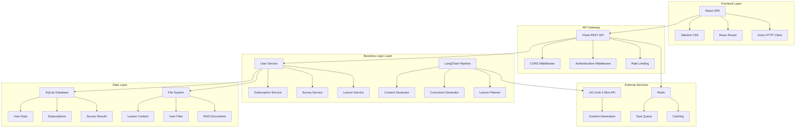
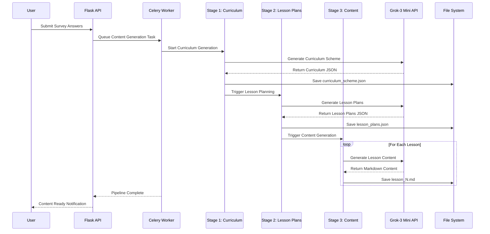
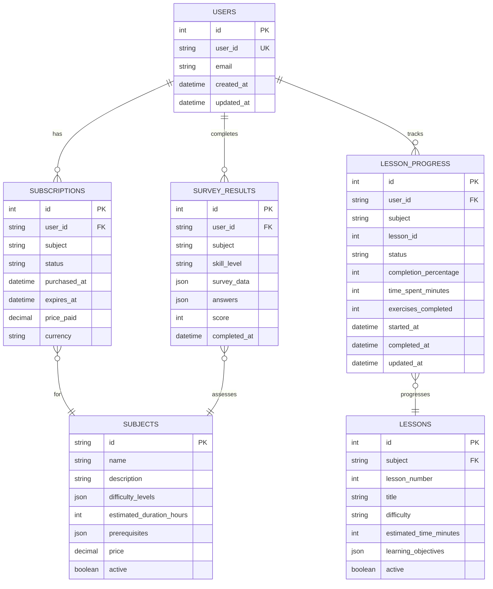
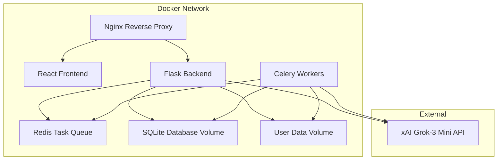

# MindCoach Developer Guide

This comprehensive guide covers the technical architecture, development workflow, and deployment procedures for the MindCoach Personalized Learning Path Generator.

## Table of Contents

1. [Architecture Overview](#architecture-overview)
2. [LangChain Pipeline Architecture](#langchain-pipeline-architecture)
3. [RAG Document System](#rag-document-system)
4. [Database Schema](#database-schema)
5. [Development Workflow](#development-workflow)
6. [Testing Strategy](#testing-strategy)
7. [Docker Deployment](#docker-deployment)
8. [Contribution Guidelines](#contribution-guidelines)
9. [Performance Optimization](#performance-optimization)
10. [Security Considerations](#security-considerations)

## Architecture Overview

MindCoach follows a modern full-stack architecture with clear separation of concerns:

### System Architecture Diagram



### Component Responsibilities

#### Frontend Components
- **React SPA**: Single-page application with component-based architecture
- **Responsive Layout**: Tailwind CSS for mobile-first responsive design
- **State Management**: React hooks and context for application state
- **API Integration**: Axios for HTTP requests with error handling
- **Accessibility**: WCAG 2.1 AA compliance with screen reader support

#### Backend Services
- **Flask API**: RESTful API with blueprint-based organization
- **Authentication**: User ID-based authentication with JWT planned
- **Business Logic**: Service layer pattern for domain logic
- **Data Access**: Repository pattern with SQLAlchemy ORM
- **Background Tasks**: Celery with Redis for asynchronous processing

#### Data Storage
- **SQLite Database**: Structured data (users, subscriptions, metadata)
- **File System**: Lesson content, user data, and RAG documents
- **Redis Cache**: Session storage and task queue management#
# LangChain Pipeline Architecture

The content generation system uses a sophisticated three-stage LangChain pipeline powered by Grok-3 Mini via xAI's API.

### Pipeline Overview



### Stage 1: Curriculum Generation

**Purpose**: Create a comprehensive learning scheme based on survey results

**Input Data**:
- Survey answers and skill level assessment
- Subject selection and prerequisites
- User learning preferences and goals

**LangChain Implementation**:
```python
from langchain.chains import LLMChain
from langchain.prompts import PromptTemplate
from langchain_community.llms import ChatGroq

class CurriculumGeneratorChain:
    def __init__(self):
        self.llm = ChatGroq(
            model="grok-3-mini",
            api_key=os.getenv('XAI_API_KEY'),
            base_url=os.getenv('GROK_API_URL'),
            temperature=0.7,
            max_tokens=2000
        )
        
        self.prompt = PromptTemplate(
            input_variables=["survey_results", "subject", "skill_level", "rag_guidelines"],
            template="""
            Based on the following survey results for {subject}:
            {survey_results}
            
            User skill level: {skill_level}
            
            Create a comprehensive 10-lesson curriculum following these guidelines:
            {rag_guidelines}
            
            Generate a JSON response with:
            - Learning objectives
            - Lesson topics and progression
            - Prerequisites and dependencies
            - Estimated time for each lesson
            - Topics to skip based on user knowledge
            
            Format as valid JSON only.
            """
        )
        
        self.chain = LLMChain(llm=self.llm, prompt=self.prompt)
    
    def generate_curriculum(self, survey_data, subject, skill_level, rag_docs):
        try:
            response = self.chain.run(
                survey_results=json.dumps(survey_data),
                subject=subject,
                skill_level=skill_level,
                rag_guidelines=rag_docs['curriculum_guidelines']
            )
            
            # Parse and validate JSON response
            curriculum_data = json.loads(response)
            return self._validate_curriculum_schema(curriculum_data)
            
        except Exception as e:
            logger.error(f"Curriculum generation failed: {str(e)}")
            raise ContentGenerationError(f"Failed to generate curriculum: {str(e)}")
```

**Output**: `curriculum_scheme.json` with structured learning path

### Stage 2: Lesson Planning

**Purpose**: Create detailed lesson plans for each curriculum topic

**Input Data**:
- Generated curriculum scheme
- Subject-specific templates
- Learning objective frameworks

**LangChain Implementation**:
```python
class LessonPlannerChain:
    def __init__(self):
        self.llm = ChatGroq(
            model="grok-3-mini",
            api_key=os.getenv('XAI_API_KEY'),
            base_url=os.getenv('GROK_API_URL'),
            temperature=0.6,
            max_tokens=3000
        )
        
        self.prompt = PromptTemplate(
            input_variables=["curriculum_data", "lesson_topic", "rag_structure"],
            template="""
            Create a detailed lesson plan for: {lesson_topic}
            
            Curriculum context: {curriculum_data}
            
            Follow this lesson structure template:
            {rag_structure}
            
            Include:
            - Specific learning objectives
            - Lesson structure with time allocations
            - Interactive activities and exercises
            - Assessment methods
            - Prerequisites and follow-up topics
            
            Return as structured JSON.
            """
        )
        
        self.chain = LLMChain(llm=self.llm, prompt=self.prompt)
    
    def generate_lesson_plans(self, curriculum_data, rag_docs):
        lesson_plans = []
        
        for lesson in curriculum_data['topics']:
            try:
                response = self.chain.run(
                    curriculum_data=json.dumps(curriculum_data),
                    lesson_topic=lesson['title'],
                    rag_structure=rag_docs['lesson_structure_template']
                )
                
                lesson_plan = json.loads(response)
                lesson_plan['lesson_id'] = lesson['lesson_id']
                lesson_plans.append(lesson_plan)
                
            except Exception as e:
                logger.error(f"Lesson planning failed for {lesson['title']}: {str(e)}")
                continue
        
        return {'lesson_plans': lesson_plans}
```

**Output**: `lesson_plans.json` with detailed lesson structures

### Stage 3: Content Generation

**Purpose**: Generate complete lesson content with explanations, examples, and exercises

**Input Data**:
- Detailed lesson plans
- Content quality standards
- Subject-specific examples and templates

**LangChain Implementation**:
```python
class ContentGeneratorChain:
    def __init__(self):
        self.llm = ChatGroq(
            model="grok-3-mini",
            api_key=os.getenv('XAI_API_KEY'),
            base_url=os.getenv('GROK_API_URL'),
            temperature=0.5,
            max_tokens=4000
        )
        
        self.prompt = PromptTemplate(
            input_variables=["lesson_plan", "content_standards", "subject"],
            template="""
            Generate complete lesson content for {subject} based on this lesson plan:
            {lesson_plan}
            
            Follow these content standards:
            {content_standards}
            
            Create comprehensive markdown content including:
            1. Introduction with learning objectives
            2. Concept explanations with clear examples
            3. Two practical code examples with comments
            4. Three hands-on exercises with solutions
            5. Key takeaways and next steps
            
            Use proper markdown formatting with headers, code blocks, and lists.
            Ensure content is engaging and appropriate for the target skill level.
            """
        )
        
        self.chain = LLMChain(llm=self.llm, prompt=self.prompt)
    
    def generate_content(self, lesson_plan, subject, rag_docs):
        try:
            response = self.chain.run(
                lesson_plan=json.dumps(lesson_plan),
                subject=subject,
                content_standards=rag_docs['content_quality_standards']
            )
            
            # Validate markdown structure and content quality
            return self._validate_content_quality(response)
            
        except Exception as e:
            logger.error(f"Content generation failed: {str(e)}")
            raise ContentGenerationError(f"Failed to generate content: {str(e)}")
```

**Output**: Individual `lesson_N.md` files with complete lesson content

### Pipeline Orchestration

The pipeline is orchestrated using Celery for background processing:

```python
@celery.task(bind=True, name='content_generation.generate_full_course')
def generate_full_course(self, user_id, subject, survey_data):
    """Main orchestration task for the three-stage pipeline"""
    try:
        # Stage 1: Generate Curriculum
        self.update_state(state='PROGRESS', meta={'stage': 'curriculum', 'progress': 0})
        curriculum_chain = CurriculumGeneratorChain()
        curriculum_data = curriculum_chain.generate_curriculum(
            survey_data, subject, survey_data['skill_level'], load_rag_documents('curriculum')
        )
        
        # Stage 2: Generate Lesson Plans
        self.update_state(state='PROGRESS', meta={'stage': 'lesson_plans', 'progress': 33})
        planner_chain = LessonPlannerChain()
        lesson_plans_data = planner_chain.generate_lesson_plans(
            curriculum_data, load_rag_documents('lesson_plans')
        )
        
        # Stage 3: Generate Content (parallel processing)
        self.update_state(state='PROGRESS', meta={'stage': 'content', 'progress': 66})
        content_chain = ContentGeneratorChain()
        
        # Process lessons in parallel using Celery groups
        from celery import group
        content_tasks = group(
            generate_lesson_content.s(user_id, subject, lesson_plan)
            for lesson_plan in lesson_plans_data['lesson_plans']
        )
        
        content_results = content_tasks.apply_async()
        content_results.get()  # Wait for all content generation to complete
        
        self.update_state(state='SUCCESS', meta={'stage': 'complete', 'progress': 100})
        return {'status': 'completed', 'lessons_generated': len(lesson_plans_data['lesson_plans'])}
        
    except Exception as exc:
        self.update_state(state='FAILURE', meta={'error': str(exc)})
        raise
```

### Error Handling and Retry Logic

```python
class ContentGenerationError(Exception):
    """Custom exception for content generation failures"""
    pass

def retry_with_backoff(max_retries=3, backoff_factor=2):
    """Decorator for implementing exponential backoff retry logic"""
    def decorator(func):
        def wrapper(*args, **kwargs):
            for attempt in range(max_retries):
                try:
                    return func(*args, **kwargs)
                except Exception as e:
                    if attempt == max_retries - 1:
                        raise
                    
                    wait_time = backoff_factor ** attempt
                    logger.warning(f"Attempt {attempt + 1} failed: {str(e)}. Retrying in {wait_time}s")
                    time.sleep(wait_time)
            
        return wrapper
    return decorator

@retry_with_backoff(max_retries=3)
def call_grok_api(prompt, **kwargs):
    """Wrapper for Grok API calls with retry logic"""
    response = llm.invoke(prompt, **kwargs)
    
    if not response or len(response.strip()) < 100:
        raise ContentGenerationError("Generated content too short or empty")
    
    return response
```## 
RAG Document System

The Retrieval-Augmented Generation (RAG) system ensures consistent content quality and structure across all AI-generated materials.

### RAG Document Structure

```
rag_docs/
├── curriculum/
│   ├── curriculum_guidelines.md      # Overall curriculum structure
│   ├── subject_templates/            # Subject-specific templates
│   │   ├── python_curriculum.md
│   │   ├── javascript_curriculum.md
│   │   └── react_curriculum.md
│   └── learning_progressions.md      # Skill level progressions
├── lesson_plans/
│   ├── lesson_structure_template.md  # Standard lesson format
│   ├── activity_templates.md         # Interactive activity types
│   └── assessment_methods.md         # Assessment strategies
├── content/
│   ├── content_quality_standards.md  # Writing and formatting standards
│   ├── code_example_guidelines.md    # Code quality requirements
│   └── exercise_templates.md         # Exercise design patterns
└── survey/
    ├── question_templates.md          # Survey question formats
    └── assessment_criteria.md         # Skill evaluation methods
```

### RAG Document Implementation

#### Loading RAG Documents
```python
import os
import markdown
from pathlib import Path

class RAGDocumentLoader:
    def __init__(self, rag_docs_path="rag_docs"):
        self.rag_docs_path = Path(rag_docs_path)
        self._cache = {}
    
    def load_document(self, doc_type, doc_name):
        """Load a specific RAG document"""
        cache_key = f"{doc_type}/{doc_name}"
        
        if cache_key in self._cache:
            return self._cache[cache_key]
        
        doc_path = self.rag_docs_path / doc_type / f"{doc_name}.md"
        
        if not doc_path.exists():
            raise FileNotFoundError(f"RAG document not found: {doc_path}")
        
        with open(doc_path, 'r', encoding='utf-8') as f:
            content = f.read()
        
        # Cache the document
        self._cache[cache_key] = content
        return content
    
    def load_documents_for_stage(self, stage):
        """Load all documents for a specific pipeline stage"""
        stage_docs = {}
        stage_path = self.rag_docs_path / stage
        
        if not stage_path.exists():
            return stage_docs
        
        for doc_file in stage_path.glob("*.md"):
            doc_name = doc_file.stem
            with open(doc_file, 'r', encoding='utf-8') as f:
                stage_docs[doc_name] = f.read()
        
        return stage_docs
    
    def reload_cache(self):
        """Clear cache to reload documents"""
        self._cache.clear()

# Global RAG loader instance
rag_loader = RAGDocumentLoader()

def load_rag_documents(stage):
    """Convenience function to load RAG documents for a pipeline stage"""
    return rag_loader.load_documents_for_stage(stage)
```

#### Sample RAG Documents

**curriculum/curriculum_guidelines.md**:
```markdown
# Curriculum Generation Guidelines

## Structure Requirements

### Learning Objectives
- Each curriculum must have 3-5 high-level learning objectives
- Objectives should be measurable and achievable
- Use action verbs: understand, implement, analyze, create, evaluate

### Lesson Progression
- 10 lessons maximum per subject
- Logical progression from basic to advanced concepts
- Each lesson builds on previous knowledge
- Clear prerequisites and dependencies

### Skill Level Adaptation
- **Beginner**: Focus on fundamentals, more examples, step-by-step guidance
- **Intermediate**: Practical applications, problem-solving, best practices
- **Advanced**: Complex scenarios, optimization, architectural patterns

### Topic Selection
- Skip topics user demonstrated mastery in survey
- Include practical, real-world applications
- Balance theory with hands-on practice
- Ensure industry relevance

## JSON Output Format

```json
{
  "curriculum": {
    "subject": "string",
    "skill_level": "beginner|intermediate|advanced",
    "total_lessons": 10,
    "learning_objectives": ["objective1", "objective2"],
    "topics": [
      {
        "lesson_id": 1,
        "title": "Lesson Title",
        "topics": ["topic1", "topic2"],
        "prerequisites": [0],
        "difficulty": "beginner|intermediate|advanced",
        "estimated_time": "2.5 hours"
      }
    ]
  }
}
```
```

**lesson_plans/lesson_structure_template.md**:
```markdown
# Lesson Plan Structure Template

## Required Components

### 1. Learning Objectives (5 minutes)
- 2-3 specific, measurable objectives
- Clear success criteria
- Connection to overall curriculum goals

### 2. Introduction (5 minutes)
- Hook to engage learner interest
- Context and real-world relevance
- Preview of lesson content

### 3. Main Content (20-25 minutes)
- Core concept explanations
- Visual aids and diagrams where helpful
- Progressive complexity building

### 4. Code Examples (10-15 minutes)
- 2 practical examples minimum
- Fully commented code
- Different complexity levels
- Runnable and tested examples

### 5. Hands-on Exercises (15-20 minutes)
- 3 exercises with increasing difficulty
- Clear instructions and expected outcomes
- Hints and guidance for struggling learners
- Solution explanations

### 6. Summary and Next Steps (5 minutes)
- Key takeaways recap
- Common pitfalls to avoid
- Preview of next lesson
- Additional resources

## Time Allocation Guidelines
- Total lesson time: 50-60 minutes
- Interactive content: 60% of lesson time
- Reading/explanation: 40% of lesson time
- Exercises should be completable within allocated time

## Assessment Integration
- Formative assessment throughout lesson
- Summative assessment at lesson end
- Self-check opportunities
- Progress tracking integration
```

**content/content_quality_standards.md**:
```markdown
# Content Quality Standards

## Writing Standards

### Clarity and Readability
- Use clear, concise language
- Avoid unnecessary jargon
- Define technical terms when first introduced
- Use active voice where possible
- Maintain consistent terminology

### Structure and Organization
- Use proper markdown headers (H1-H6)
- Logical information hierarchy
- Bullet points for lists
- Numbered lists for sequential steps
- Code blocks with syntax highlighting

### Code Quality Requirements
- All code examples must be syntactically correct
- Include comprehensive comments
- Follow language-specific style guides
- Use meaningful variable and function names
- Provide context for code snippets

### Exercise Design
- Clear problem statements
- Appropriate difficulty progression
- Multiple solution approaches when applicable
- Detailed solution explanations
- Extension challenges for advanced learners

## Accessibility Standards
- Alt text for images and diagrams
- Descriptive link text
- Proper heading hierarchy
- High contrast code highlighting
- Screen reader friendly formatting

## Engagement Principles
- Real-world examples and use cases
- Interactive elements where possible
- Varied content types (text, code, exercises)
- Progressive disclosure of complexity
- Encouraging and supportive tone
```

### RAG Document Management

#### Version Control
```python
class RAGDocumentManager:
    def __init__(self, rag_docs_path="rag_docs"):
        self.rag_docs_path = Path(rag_docs_path)
        self.version_file = self.rag_docs_path / "version.json"
    
    def get_document_version(self):
        """Get current RAG document version"""
        if self.version_file.exists():
            with open(self.version_file, 'r') as f:
                return json.load(f)
        return {"version": "1.0.0", "updated_at": None}
    
    def update_document_version(self):
        """Update RAG document version after changes"""
        current_version = self.get_document_version()
        
        # Simple version increment (in production, use semantic versioning)
        version_parts = current_version["version"].split(".")
        version_parts[-1] = str(int(version_parts[-1]) + 1)
        new_version = ".".join(version_parts)
        
        version_data = {
            "version": new_version,
            "updated_at": datetime.utcnow().isoformat(),
            "changes": "RAG documents updated"
        }
        
        with open(self.version_file, 'w') as f:
            json.dump(version_data, f, indent=2)
        
        # Clear RAG loader cache to force reload
        rag_loader.reload_cache()
        
        return version_data
    
    def validate_document_structure(self, doc_path):
        """Validate RAG document follows required structure"""
        with open(doc_path, 'r', encoding='utf-8') as f:
            content = f.read()
        
        # Basic validation checks
        if len(content.strip()) < 100:
            raise ValueError("Document too short")
        
        if not content.startswith('#'):
            raise ValueError("Document must start with a header")
        
        # Additional validation logic here
        return True
```

#### Dynamic RAG Updates
```python
@app.route('/api/admin/rag-docs/<doc_type>/<doc_name>', methods=['PUT'])
@admin_required
def update_rag_document(doc_type, doc_name):
    """Update a RAG document (admin only)"""
    try:
        content = request.json.get('content')
        if not content:
            return jsonify({'error': 'Content is required'}), 400
        
        # Validate document structure
        rag_manager = RAGDocumentManager()
        doc_path = rag_manager.rag_docs_path / doc_type / f"{doc_name}.md"
        
        # Create backup
        backup_path = doc_path.with_suffix('.md.backup')
        if doc_path.exists():
            shutil.copy2(doc_path, backup_path)
        
        # Write new content
        doc_path.parent.mkdir(parents=True, exist_ok=True)
        with open(doc_path, 'w', encoding='utf-8') as f:
            f.write(content)
        
        # Validate new document
        rag_manager.validate_document_structure(doc_path)
        
        # Update version
        version_data = rag_manager.update_document_version()
        
        return jsonify({
            'success': True,
            'message': 'RAG document updated successfully',
            'version': version_data
        })
        
    except Exception as e:
        # Restore backup if validation fails
        if backup_path.exists():
            shutil.copy2(backup_path, doc_path)
        
        return jsonify({'error': str(e)}), 500
```## 
Database Schema

MindCoach uses SQLite for development and testing, with PostgreSQL recommended for production deployments.

### Entity Relationship Diagram



### SQLAlchemy Models

#### User Model
```python
from sqlalchemy import Column, Integer, String, DateTime, Text
from sqlalchemy.ext.declarative import declarative_base
from sqlalchemy.sql import func
from werkzeug.security import generate_password_hash, check_password_hash

Base = declarative_base()

class User(Base):
    __tablename__ = 'users'
    
    id = Column(Integer, primary_key=True)
    user_id = Column(String(50), unique=True, nullable=False, index=True)
    email = Column(String(100), nullable=False, index=True)
    password_hash = Column(String(255))  # For future authentication
    created_at = Column(DateTime(timezone=True), server_default=func.now())
    updated_at = Column(DateTime(timezone=True), onupdate=func.now())
    
    # Relationships
    subscriptions = relationship("Subscription", back_populates="user", cascade="all, delete-orphan")
    survey_results = relationship("SurveyResult", back_populates="user", cascade="all, delete-orphan")
    lesson_progress = relationship("LessonProgress", back_populates="user", cascade="all, delete-orphan")
    
    def set_password(self, password):
        """Set password hash"""
        self.password_hash = generate_password_hash(password)
    
    def check_password(self, password):
        """Check password against hash"""
        return check_password_hash(self.password_hash, password)
    
    def to_dict(self):
        """Convert to dictionary for JSON serialization"""
        return {
            'id': self.id,
            'user_id': self.user_id,
            'email': self.email,
            'created_at': self.created_at.isoformat() if self.created_at else None,
            'updated_at': self.updated_at.isoformat() if self.updated_at else None
        }
    
    def __repr__(self):
        return f'<User {self.user_id}>'
```

#### Subscription Model
```python
from sqlalchemy import Column, Integer, String, DateTime, Decimal, ForeignKey
from sqlalchemy.orm import relationship

class Subscription(Base):
    __tablename__ = 'subscriptions'
    
    id = Column(Integer, primary_key=True)
    user_id = Column(String(50), ForeignKey('users.user_id'), nullable=False, index=True)
    subject = Column(String(50), nullable=False, index=True)
    status = Column(String(20), default='active', index=True)  # active, expired, cancelled
    purchased_at = Column(DateTime(timezone=True), server_default=func.now())
    expires_at = Column(DateTime(timezone=True))
    price_paid = Column(Decimal(10, 2))
    currency = Column(String(3), default='USD')
    payment_reference = Column(String(100))  # External payment system reference
    
    # Relationships
    user = relationship("User", back_populates="subscriptions")
    
    # Unique constraint
    __table_args__ = (
        UniqueConstraint('user_id', 'subject', name='unique_user_subject_subscription'),
    )
    
    @property
    def is_active(self):
        """Check if subscription is currently active"""
        if self.status != 'active':
            return False
        
        if self.expires_at and datetime.utcnow() > self.expires_at:
            return False
        
        return True
    
    def to_dict(self):
        return {
            'id': self.id,
            'subject': self.subject,
            'status': self.status,
            'is_active': self.is_active,
            'purchased_at': self.purchased_at.isoformat() if self.purchased_at else None,
            'expires_at': self.expires_at.isoformat() if self.expires_at else None,
            'price_paid': float(self.price_paid) if self.price_paid else None,
            'currency': self.currency
        }
    
    def __repr__(self):
        return f'<Subscription {self.user_id}:{self.subject}>'
```

#### Survey Result Model
```python
from sqlalchemy import Column, Integer, String, DateTime, Text, JSON
from sqlalchemy.dialects.postgresql import JSON as PostgresJSON
from sqlalchemy.dialects.sqlite import JSON as SQLiteJSON

class SurveyResult(Base):
    __tablename__ = 'survey_results'
    
    id = Column(Integer, primary_key=True)
    user_id = Column(String(50), ForeignKey('users.user_id'), nullable=False, index=True)
    subject = Column(String(50), nullable=False, index=True)
    skill_level = Column(String(20), index=True)  # beginner, intermediate, advanced
    survey_data = Column(JSON)  # Original survey questions
    answers = Column(JSON)      # User's answers
    score = Column(Integer)     # Overall score percentage
    analysis = Column(JSON)     # Detailed analysis results
    completed_at = Column(DateTime(timezone=True), server_default=func.now())
    
    # Relationships
    user = relationship("User", back_populates="survey_results")
    
    def to_dict(self):
        return {
            'id': self.id,
            'user_id': self.user_id,
            'subject': self.subject,
            'skill_level': self.skill_level,
            'score': self.score,
            'analysis': self.analysis,
            'completed_at': self.completed_at.isoformat() if self.completed_at else None
        }
    
    def __repr__(self):
        return f'<SurveyResult {self.user_id}:{self.subject}>'
```

#### Lesson Progress Model
```python
class LessonProgress(Base):
    __tablename__ = 'lesson_progress'
    
    id = Column(Integer, primary_key=True)
    user_id = Column(String(50), ForeignKey('users.user_id'), nullable=False, index=True)
    subject = Column(String(50), nullable=False, index=True)
    lesson_id = Column(Integer, nullable=False, index=True)
    status = Column(String(20), default='not_started', index=True)  # not_started, in_progress, completed
    completion_percentage = Column(Integer, default=0)
    time_spent_minutes = Column(Integer, default=0)
    exercises_completed = Column(Integer, default=0)
    total_exercises = Column(Integer, default=0)
    started_at = Column(DateTime(timezone=True))
    completed_at = Column(DateTime(timezone=True))
    updated_at = Column(DateTime(timezone=True), onupdate=func.now())
    
    # Relationships
    user = relationship("User", back_populates="lesson_progress")
    
    # Unique constraint
    __table_args__ = (
        UniqueConstraint('user_id', 'subject', 'lesson_id', name='unique_user_lesson_progress'),
    )
    
    def mark_started(self):
        """Mark lesson as started"""
        if self.status == 'not_started':
            self.status = 'in_progress'
            self.started_at = datetime.utcnow()
    
    def mark_completed(self):
        """Mark lesson as completed"""
        self.status = 'completed'
        self.completion_percentage = 100
        self.completed_at = datetime.utcnow()
    
    def update_progress(self, completion_percentage, time_spent=None, exercises_completed=None):
        """Update lesson progress"""
        self.completion_percentage = min(100, max(0, completion_percentage))
        
        if time_spent is not None:
            self.time_spent_minutes += time_spent
        
        if exercises_completed is not None:
            self.exercises_completed = exercises_completed
        
        if self.completion_percentage == 100:
            self.mark_completed()
        elif self.status == 'not_started':
            self.mark_started()
    
    def to_dict(self):
        return {
            'lesson_id': self.lesson_id,
            'status': self.status,
            'completion_percentage': self.completion_percentage,
            'time_spent_minutes': self.time_spent_minutes,
            'exercises_completed': self.exercises_completed,
            'total_exercises': self.total_exercises,
            'started_at': self.started_at.isoformat() if self.started_at else None,
            'completed_at': self.completed_at.isoformat() if self.completed_at else None,
            'updated_at': self.updated_at.isoformat() if self.updated_at else None
        }
    
    def __repr__(self):
        return f'<LessonProgress {self.user_id}:{self.subject}:{self.lesson_id}>'
```

### Database Migrations

#### Migration System Setup
```python
# migrate.py
import os
from alembic.config import Config
from alembic import command
from sqlalchemy import create_engine
from app.models import Base

def run_migrations():
    """Run database migrations"""
    database_url = os.getenv('DATABASE_URL', 'sqlite:///mindcoach.db')
    
    # Create engine
    engine = create_engine(database_url)
    
    # Create all tables (for initial setup)
    Base.metadata.create_all(engine)
    
    # Run Alembic migrations
    alembic_cfg = Config("alembic.ini")
    command.upgrade(alembic_cfg, "head")

def create_migration(message):
    """Create a new migration"""
    alembic_cfg = Config("alembic.ini")
    command.revision(alembic_cfg, message=message, autogenerate=True)

if __name__ == "__main__":
    import sys
    
    if len(sys.argv) > 1 and sys.argv[1] == "create":
        message = sys.argv[2] if len(sys.argv) > 2 else "Auto-generated migration"
        create_migration(message)
    else:
        run_migrations()
```

#### Sample Migration Script
```python
# migrations/versions/001_initial_schema.py
"""Initial schema

Revision ID: 001
Revises: 
Create Date: 2024-01-15 10:00:00.000000

"""
from alembic import op
import sqlalchemy as sa
from sqlalchemy.dialects import sqlite

# revision identifiers
revision = '001'
down_revision = None
branch_labels = None
depends_on = None

def upgrade():
    # Create users table
    op.create_table('users',
        sa.Column('id', sa.Integer(), nullable=False),
        sa.Column('user_id', sa.String(length=50), nullable=False),
        sa.Column('email', sa.String(length=100), nullable=False),
        sa.Column('password_hash', sa.String(length=255), nullable=True),
        sa.Column('created_at', sa.DateTime(timezone=True), server_default=sa.text('now()'), nullable=True),
        sa.Column('updated_at', sa.DateTime(timezone=True), nullable=True),
        sa.PrimaryKeyConstraint('id'),
        sa.UniqueConstraint('user_id')
    )
    op.create_index(op.f('ix_users_email'), 'users', ['email'], unique=False)
    op.create_index(op.f('ix_users_user_id'), 'users', ['user_id'], unique=False)

    # Create subscriptions table
    op.create_table('subscriptions',
        sa.Column('id', sa.Integer(), nullable=False),
        sa.Column('user_id', sa.String(length=50), nullable=False),
        sa.Column('subject', sa.String(length=50), nullable=False),
        sa.Column('status', sa.String(length=20), nullable=True),
        sa.Column('purchased_at', sa.DateTime(timezone=True), server_default=sa.text('now()'), nullable=True),
        sa.Column('expires_at', sa.DateTime(timezone=True), nullable=True),
        sa.Column('price_paid', sa.Numeric(precision=10, scale=2), nullable=True),
        sa.Column('currency', sa.String(length=3), nullable=True),
        sa.Column('payment_reference', sa.String(length=100), nullable=True),
        sa.ForeignKeyConstraint(['user_id'], ['users.user_id'], ),
        sa.PrimaryKeyConstraint('id'),
        sa.UniqueConstraint('user_id', 'subject', name='unique_user_subject_subscription')
    )
    op.create_index(op.f('ix_subscriptions_status'), 'subscriptions', ['status'], unique=False)
    op.create_index(op.f('ix_subscriptions_subject'), 'subscriptions', ['subject'], unique=False)
    op.create_index(op.f('ix_subscriptions_user_id'), 'subscriptions', ['user_id'], unique=False)

    # Additional tables...

def downgrade():
    op.drop_table('subscriptions')
    op.drop_table('users')
    # Additional cleanup...
```

### Database Utilities

#### Connection Management
```python
# app/database.py
from sqlalchemy import create_engine
from sqlalchemy.orm import sessionmaker, scoped_session
from contextlib import contextmanager
import os

# Database configuration
DATABASE_URL = os.getenv('DATABASE_URL', 'sqlite:///mindcoach.db')

# Create engine with appropriate settings
if DATABASE_URL.startswith('sqlite'):
    engine = create_engine(
        DATABASE_URL,
        echo=os.getenv('FLASK_ENV') == 'development',
        connect_args={'check_same_thread': False}
    )
else:
    engine = create_engine(
        DATABASE_URL,
        echo=os.getenv('FLASK_ENV') == 'development',
        pool_size=10,
        max_overflow=20,
        pool_pre_ping=True
    )

# Create session factory
SessionLocal = sessionmaker(autocommit=False, autoflush=False, bind=engine)
Session = scoped_session(SessionLocal)

@contextmanager
def get_db_session():
    """Context manager for database sessions"""
    session = Session()
    try:
        yield session
        session.commit()
    except Exception:
        session.rollback()
        raise
    finally:
        session.close()

def init_db():
    """Initialize database with all tables"""
    from app.models import Base
    Base.metadata.create_all(bind=engine)

def drop_db():
    """Drop all database tables (use with caution!)"""
    from app.models import Base
    Base.metadata.drop_all(bind=engine)
```

#### Repository Pattern Implementation
```python
# app/repositories/base_repository.py
from abc import ABC, abstractmethod
from typing import List, Optional, Dict, Any
from sqlalchemy.orm import Session

class BaseRepository(ABC):
    def __init__(self, session: Session, model_class):
        self.session = session
        self.model_class = model_class
    
    def create(self, **kwargs) -> Any:
        """Create a new record"""
        instance = self.model_class(**kwargs)
        self.session.add(instance)
        self.session.flush()
        return instance
    
    def get_by_id(self, id: int) -> Optional[Any]:
        """Get record by ID"""
        return self.session.query(self.model_class).filter(
            self.model_class.id == id
        ).first()
    
    def get_all(self, limit: int = None, offset: int = None) -> List[Any]:
        """Get all records with optional pagination"""
        query = self.session.query(self.model_class)
        
        if offset:
            query = query.offset(offset)
        if limit:
            query = query.limit(limit)
        
        return query.all()
    
    def update(self, id: int, **kwargs) -> Optional[Any]:
        """Update record by ID"""
        instance = self.get_by_id(id)
        if instance:
            for key, value in kwargs.items():
                if hasattr(instance, key):
                    setattr(instance, key, value)
            self.session.flush()
        return instance
    
    def delete(self, id: int) -> bool:
        """Delete record by ID"""
        instance = self.get_by_id(id)
        if instance:
            self.session.delete(instance)
            self.session.flush()
            return True
        return False
    
    def count(self) -> int:
        """Count total records"""
        return self.session.query(self.model_class).count()

# app/repositories/user_repository.py
from app.models import User
from app.repositories.base_repository import BaseRepository

class UserRepository(BaseRepository):
    def __init__(self, session: Session):
        super().__init__(session, User)
    
    def get_by_user_id(self, user_id: str) -> Optional[User]:
        """Get user by user_id"""
        return self.session.query(User).filter(
            User.user_id == user_id
        ).first()
    
    def get_by_email(self, email: str) -> Optional[User]:
        """Get user by email"""
        return self.session.query(User).filter(
            User.email == email
        ).first()
    
    def user_exists(self, user_id: str) -> bool:
        """Check if user exists"""
        return self.session.query(User).filter(
            User.user_id == user_id
        ).first() is not None
```## Developme
nt Workflow

### Git Workflow

MindCoach follows a feature-branch workflow with automated testing and deployment.

#### Branch Strategy
```
main (production)
├── develop (integration)
│   ├── feature/user-authentication
│   ├── feature/langchain-integration
│   └── feature/responsive-design
├── hotfix/critical-bug-fix
└── release/v1.2.0
```

#### Feature Development Process
1. **Create Feature Branch**
   ```bash
   git checkout develop
   git pull origin develop
   git checkout -b feature/your-feature-name
   ```

2. **Development Cycle**
   ```bash
   # Make changes
   git add .
   git commit -m "feat: implement user authentication"
   
   # Push regularly
   git push origin feature/your-feature-name
   ```

3. **Pre-merge Checklist**
   - [ ] All tests pass locally
   - [ ] Code follows style guidelines
   - [ ] Documentation updated
   - [ ] No merge conflicts with develop
   - [ ] Feature tested in multiple browsers

4. **Create Pull Request**
   - Target: `develop` branch
   - Include: Feature description, testing notes, screenshots
   - Request: Code review from team members

5. **Code Review Process**
   - Automated checks must pass
   - At least one approval required
   - Address all review comments
   - Squash commits before merge

#### Commit Message Convention
```
<type>(<scope>): <description>

[optional body]

[optional footer]
```

**Types:**
- `feat`: New feature
- `fix`: Bug fix
- `docs`: Documentation changes
- `style`: Code style changes
- `refactor`: Code refactoring
- `test`: Adding or updating tests
- `chore`: Maintenance tasks

**Examples:**
```bash
feat(auth): add JWT token authentication
fix(survey): resolve question generation timeout
docs(api): update endpoint documentation
test(lessons): add integration tests for lesson generation
```

### Development Environment Setup

#### Prerequisites Installation
```bash
# Python environment
python -m venv venv
source venv/bin/activate  # Linux/Mac
venv\Scripts\activate     # Windows

pip install -r backend/requirements.txt

# Node.js environment
cd frontend
npm install

# Redis (for task queue)
# Ubuntu/Debian
sudo apt install redis-server

# macOS
brew install redis

# Windows
# Download from https://redis.io/download
```

#### Environment Configuration
```bash
# Backend environment
cp backend/.env.example backend/.env

# Edit backend/.env with your settings:
SECRET_KEY=your-secret-key-here
XAI_API_KEY=your-xai-api-key
GROK_API_URL=https://api.x.ai/v1
DATABASE_URL=sqlite:///mindcoach.db
REDIS_URL=redis://localhost:6379/0
```

#### Development Services
```bash
# Terminal 1: Start Redis
redis-server

# Terminal 2: Start Backend
cd backend
python run.py

# Terminal 3: Start Celery Worker
cd backend
celery -A app.celery worker --loglevel=info

# Terminal 4: Start Frontend
cd frontend
npm start
```

### Code Quality Standards

#### Python Code Style
```python
# Use Black for formatting
black backend/

# Use Flake8 for linting
flake8 backend/ --max-line-length=88 --extend-ignore=E203,W503

# Use isort for import sorting
isort backend/

# Type hints for function signatures
def generate_curriculum(
    survey_data: Dict[str, Any],
    subject: str,
    skill_level: str
) -> Dict[str, Any]:
    """Generate curriculum based on survey results."""
    pass
```

#### JavaScript Code Style
```javascript
// Use Prettier for formatting
npm run format

// Use ESLint for linting
npm run lint

// PropTypes for React components
import PropTypes from 'prop-types';

const LessonViewer = ({ lessonId, content, onComplete }) => {
  // Component implementation
};

LessonViewer.propTypes = {
  lessonId: PropTypes.number.isRequired,
  content: PropTypes.string.isRequired,
  onComplete: PropTypes.func
};
```

#### Code Review Guidelines

**What to Look For:**
- [ ] Code follows style guidelines
- [ ] Functions are well-documented
- [ ] Error handling is appropriate
- [ ] Tests cover new functionality
- [ ] No hardcoded values or secrets
- [ ] Performance considerations addressed
- [ ] Accessibility requirements met
- [ ] Security best practices followed

**Review Process:**
1. **Automated Checks**: CI/CD pipeline runs tests and linting
2. **Manual Review**: Team member reviews code logic and design
3. **Testing**: Reviewer tests functionality locally
4. **Approval**: Approve or request changes
5. **Merge**: Squash and merge to develop branch

### Automated Git Workflow

MindCoach includes an automated git workflow that commits and pushes code when tasks are completed.

#### Git Automation Configuration
```python
# .kiro/hooks/git_automation.py
import subprocess
import json
import os
from datetime import datetime

class GitAutomation:
    def __init__(self, repo_path="."):
        self.repo_path = repo_path
        self.git_cmd = ["git", "-C", repo_path]
    
    def stage_all_changes(self):
        """Stage all new and modified files"""
        try:
            result = subprocess.run(
                self.git_cmd + ["add", "."],
                capture_output=True,
                text=True,
                check=True
            )
            return True
        except subprocess.CalledProcessError as e:
            print(f"Error staging files: {e.stderr}")
            return False
    
    def create_commit(self, task_number, task_description):
        """Create commit with task information"""
        commit_message = f"Complete Task {task_number}: {task_description}"
        
        try:
            result = subprocess.run(
                self.git_cmd + ["commit", "-m", commit_message],
                capture_output=True,
                text=True,
                check=True
            )
            return True
        except subprocess.CalledProcessError as e:
            print(f"Error creating commit: {e.stderr}")
            return False
    
    def push_changes(self, branch="main"):
        """Push changes to remote repository"""
        try:
            result = subprocess.run(
                self.git_cmd + ["push", "origin", branch],
                capture_output=True,
                text=True,
                check=True
            )
            return True
        except subprocess.CalledProcessError as e:
            print(f"Error pushing changes: {e.stderr}")
            return False
    
    def get_current_branch(self):
        """Get current git branch"""
        try:
            result = subprocess.run(
                self.git_cmd + ["branch", "--show-current"],
                capture_output=True,
                text=True,
                check=True
            )
            return result.stdout.strip()
        except subprocess.CalledProcessError:
            return "main"  # Default fallback

def monitor_task_completion():
    """Monitor tasks.md for completed tasks and trigger git automation"""
    tasks_file = ".kiro/specs/personalized-learning-path-generator/tasks.md"
    
    if not os.path.exists(tasks_file):
        return
    
    with open(tasks_file, 'r') as f:
        content = f.read()
    
    # Parse completed top-level tasks
    completed_tasks = []
    lines = content.split('\n')
    
    for line in lines:
        if line.strip().startswith('- [x]') and not line.strip().startswith('  '):
            # Extract task number and description
            task_match = re.search(r'- \[x\] (\d+(?:\.\d+)?)\. (.+)', line)
            if task_match:
                task_number = task_match.group(1)
                task_description = task_match.group(2)
                completed_tasks.append((task_number, task_description))
    
    # Process each completed task
    git_automation = GitAutomation()
    
    for task_number, task_description in completed_tasks:
        if not is_task_already_committed(task_number):
            if git_automation.stage_all_changes():
                if git_automation.create_commit(task_number, task_description):
                    current_branch = git_automation.get_current_branch()
                    git_automation.push_changes(current_branch)
                    mark_task_as_committed(task_number)

if __name__ == "__main__":
    monitor_task_completion()
```

#### Git Hook Integration
```bash
# .git/hooks/post-commit
#!/bin/bash
# Trigger git automation after commits
python .kiro/hooks/git_automation.py
```

### Testing Strategy

#### Test Structure
```
tests/
├── backend/
│   ├── unit/
│   │   ├── test_models.py
│   │   ├── test_services.py
│   │   └── test_utils.py
│   ├── integration/
│   │   ├── test_api_endpoints.py
│   │   ├── test_database.py
│   │   └── test_langchain_pipeline.py
│   └── e2e/
│       ├── test_user_journey.py
│       └── test_content_generation.py
├── frontend/
│   ├── unit/
│   │   ├── components/
│   │   └── services/
│   ├── integration/
│   │   └── api/
│   └── e2e/
│       └── cypress/
└── shared/
    ├── fixtures/
    └── utilities/
```

#### Backend Testing
```python
# tests/backend/unit/test_services.py
import pytest
from unittest.mock import Mock, patch
from app.services.survey_service import SurveyService

class TestSurveyService:
    def setup_method(self):
        self.survey_service = SurveyService()
    
    @patch('app.services.survey_service.ChatGroq')
    def test_generate_survey_success(self, mock_llm):
        # Arrange
        mock_llm.return_value.invoke.return_value = '{"questions": []}'
        
        # Act
        result = self.survey_service.generate_survey("python", "beginner")
        
        # Assert
        assert result is not None
        assert "questions" in result
        mock_llm.return_value.invoke.assert_called_once()
    
    def test_analyze_survey_results(self):
        # Test survey analysis logic
        survey_data = {
            "questions": [{"id": 1, "correct_answer": "B"}],
            "answers": [{"question_id": 1, "answer": "B"}]
        }
        
        result = self.survey_service.analyze_results(survey_data)
        
        assert result["score"] == 100
        assert result["skill_level"] == "intermediate"

# tests/backend/integration/test_api_endpoints.py
import pytest
from flask import Flask
from app import create_app
from app.database import get_db_session

@pytest.fixture
def client():
    app = create_app(testing=True)
    with app.test_client() as client:
        with app.app_context():
            yield client

class TestUserAPI:
    def test_create_user(self, client):
        response = client.post('/api/users', json={
            'user_id': 'test_user',
            'email': 'test@example.com'
        })
        
        assert response.status_code == 201
        data = response.get_json()
        assert data['success'] is True
        assert data['data']['user_id'] == 'test_user'
    
    def test_get_user_profile(self, client):
        # Create user first
        client.post('/api/users', json={
            'user_id': 'test_user',
            'email': 'test@example.com'
        })
        
        response = client.get('/api/users/test_user')
        
        assert response.status_code == 200
        data = response.get_json()
        assert data['data']['user_id'] == 'test_user'
```

#### Frontend Testing
```javascript
// src/components/__tests__/SubjectSelector.test.js
import React from 'react';
import { render, screen, fireEvent, waitFor } from '@testing-library/react';
import '@testing-library/jest-dom';
import SubjectSelector from '../SubjectSelector';
import * as subjectService from '../../services/subjectService';

// Mock the service
jest.mock('../../services/subjectService');

describe('SubjectSelector', () => {
  const mockSubjects = [
    { id: 'python', name: 'Python Programming', price: 29.99 },
    { id: 'javascript', name: 'JavaScript Development', price: 29.99 }
  ];

  beforeEach(() => {
    subjectService.getAvailableSubjects.mockResolvedValue(mockSubjects);
  });

  test('renders subject list', async () => {
    render(<SubjectSelector onSubjectSelect={jest.fn()} />);
    
    await waitFor(() => {
      expect(screen.getByText('Python Programming')).toBeInTheDocument();
      expect(screen.getByText('JavaScript Development')).toBeInTheDocument();
    });
  });

  test('calls onSubjectSelect when subject is clicked', async () => {
    const mockOnSelect = jest.fn();
    render(<SubjectSelector onSubjectSelect={mockOnSelect} />);
    
    await waitFor(() => {
      fireEvent.click(screen.getByText('Python Programming'));
    });
    
    expect(mockOnSelect).toHaveBeenCalledWith('python');
  });

  test('displays subscription status correctly', async () => {
    const mockSubjectsWithStatus = mockSubjects.map(subject => ({
      ...subject,
      hasAccess: subject.id === 'python'
    }));
    
    subjectService.getAvailableSubjects.mockResolvedValue(mockSubjectsWithStatus);
    
    render(<SubjectSelector onSubjectSelect={jest.fn()} />);
    
    await waitFor(() => {
      expect(screen.getByText('✅')).toBeInTheDocument(); // Python available
      expect(screen.getByText('🔒')).toBeInTheDocument(); // JavaScript locked
    });
  });
});

// cypress/e2e/complete-user-journey.cy.js
describe('Complete User Journey', () => {
  beforeEach(() => {
    cy.visit('/');
    cy.intercept('GET', '/api/subjects', { fixture: 'subjects.json' });
    cy.intercept('POST', '/api/users/*/subjects/*/survey/generate', { fixture: 'survey-task.json' });
  });

  it('completes full learning path creation', () => {
    // Subject selection
    cy.get('[data-testid="subject-selector"]').should('be.visible');
    cy.get('[data-testid="subject-python"]').click();
    
    // Survey generation
    cy.get('[data-testid="generate-survey-btn"]').click();
    cy.get('[data-testid="survey-progress"]').should('be.visible');
    
    // Take survey
    cy.get('[data-testid="survey-question-1"]').should('be.visible');
    cy.get('[data-testid="answer-option-b"]').click();
    cy.get('[data-testid="next-question-btn"]').click();
    
    // Submit survey
    cy.get('[data-testid="submit-survey-btn"]').click();
    
    // Content generation
    cy.get('[data-testid="content-generation-progress"]').should('be.visible');
    cy.get('[data-testid="stage-curriculum"]', { timeout: 30000 }).should('contain', 'Complete');
    
    // View lessons
    cy.get('[data-testid="lesson-list"]').should('be.visible');
    cy.get('[data-testid="lesson-1"]').click();
    cy.get('[data-testid="lesson-content"]').should('be.visible');
  });
});
```

#### Test Automation
```bash
# package.json scripts
{
  "scripts": {
    "test": "jest",
    "test:watch": "jest --watch",
    "test:coverage": "jest --coverage",
    "test:e2e": "cypress run",
    "test:e2e:open": "cypress open",
    "test:all": "npm run test && npm run test:e2e"
  }
}

# Backend test commands
# pytest.ini
[tool:pytest]
testpaths = tests
python_files = test_*.py
python_classes = Test*
python_functions = test_*
addopts = 
    --verbose
    --tb=short
    --cov=app
    --cov-report=html
    --cov-report=term-missing
```##
 Docker Deployment

MindCoach is designed for containerized deployment using Docker and Docker Compose.

### Container Architecture



### Dockerfile Configurations

#### Frontend Dockerfile
```dockerfile
# Dockerfile.frontend
FROM node:18-alpine AS builder

# Set working directory
WORKDIR /app

# Copy package files
COPY package*.json ./

# Install dependencies
RUN npm ci --only=production

# Copy source code
COPY . .

# Build application
RUN npm run build

# Production stage
FROM nginx:alpine

# Copy built application
COPY --from=builder /app/build /usr/share/nginx/html

# Copy nginx configuration
COPY nginx.conf /etc/nginx/nginx.conf

# Expose port
EXPOSE 80

# Health check
HEALTHCHECK --interval=30s --timeout=3s --start-period=5s --retries=3 \
  CMD curl -f http://localhost/ || exit 1

CMD ["nginx", "-g", "daemon off;"]
```

#### Backend Dockerfile
```dockerfile
# Dockerfile.backend
FROM python:3.11-slim

# Set environment variables
ENV PYTHONDONTWRITEBYTECODE=1
ENV PYTHONUNBUFFERED=1
ENV FLASK_APP=run.py

# Set working directory
WORKDIR /app

# Install system dependencies
RUN apt-get update \
    && apt-get install -y --no-install-recommends \
        gcc \
        curl \
    && rm -rf /var/lib/apt/lists/*

# Copy requirements and install Python dependencies
COPY requirements.txt .
RUN pip install --no-cache-dir -r requirements.txt

# Create non-root user
RUN adduser --disabled-password --gecos '' appuser

# Copy application code
COPY . .

# Create necessary directories
RUN mkdir -p /app/logs /app/users /app/instance \
    && chown -R appuser:appuser /app

# Switch to non-root user
USER appuser

# Expose port
EXPOSE 5000

# Health check
HEALTHCHECK --interval=30s --timeout=10s --start-period=5s --retries=3 \
  CMD curl -f http://localhost:5000/api/health || exit 1

# Run application
CMD ["gunicorn", "--bind", "0.0.0.0:5000", "--workers", "4", "--timeout", "120", "run:app"]
```

#### Celery Worker Dockerfile
```dockerfile
# Dockerfile.celery
FROM python:3.11-slim

ENV PYTHONDONTWRITEBYTECODE=1
ENV PYTHONUNBUFFERED=1

WORKDIR /app

# Install system dependencies
RUN apt-get update \
    && apt-get install -y --no-install-recommends gcc \
    && rm -rf /var/lib/apt/lists/*

# Install Python dependencies
COPY requirements.txt .
RUN pip install --no-cache-dir -r requirements.txt

# Create non-root user
RUN adduser --disabled-password --gecos '' celeryuser

# Copy application code
COPY . .

# Create necessary directories
RUN mkdir -p /app/logs /app/users \
    && chown -R celeryuser:celeryuser /app

USER celeryuser

# Health check for Celery worker
HEALTHCHECK --interval=60s --timeout=10s --start-period=10s --retries=3 \
  CMD celery -A app.celery inspect ping || exit 1

CMD ["celery", "-A", "app.celery", "worker", "--loglevel=info", "--concurrency=2"]
```

### Docker Compose Configuration

#### Production Deployment
```yaml
# docker-compose.yml
version: '3.8'

services:
  nginx:
    image: nginx:alpine
    container_name: mindcoach-nginx
    ports:
      - "80:80"
      - "443:443"
    volumes:
      - ./nginx/nginx.conf:/etc/nginx/nginx.conf:ro
      - ./nginx/ssl:/etc/nginx/ssl:ro
      - static_files:/usr/share/nginx/html/static
    depends_on:
      - frontend
      - backend
    networks:
      - mindcoach-network
    restart: unless-stopped

  frontend:
    build:
      context: ./frontend
      dockerfile: Dockerfile.frontend
    container_name: mindcoach-frontend
    volumes:
      - static_files:/usr/share/nginx/html
    networks:
      - mindcoach-network
    restart: unless-stopped

  backend:
    build:
      context: ./backend
      dockerfile: Dockerfile.backend
    container_name: mindcoach-backend
    environment:
      - FLASK_ENV=production
      - SECRET_KEY=${SECRET_KEY}
      - XAI_API_KEY=${XAI_API_KEY}
      - GROK_API_URL=${GROK_API_URL}
      - DATABASE_URL=sqlite:///data/mindcoach.db
      - REDIS_URL=redis://redis:6379/0
      - CELERY_BROKER_URL=redis://redis:6379/0
      - CELERY_RESULT_BACKEND=redis://redis:6379/0
    volumes:
      - database_data:/app/data
      - user_data:/app/users
      - logs:/app/logs
    depends_on:
      - redis
    networks:
      - mindcoach-network
    restart: unless-stopped

  celery-worker:
    build:
      context: ./backend
      dockerfile: Dockerfile.celery
    container_name: mindcoach-celery
    environment:
      - FLASK_ENV=production
      - SECRET_KEY=${SECRET_KEY}
      - XAI_API_KEY=${XAI_API_KEY}
      - GROK_API_URL=${GROK_API_URL}
      - DATABASE_URL=sqlite:///data/mindcoach.db
      - REDIS_URL=redis://redis:6379/0
      - CELERY_BROKER_URL=redis://redis:6379/0
      - CELERY_RESULT_BACKEND=redis://redis:6379/0
    volumes:
      - database_data:/app/data
      - user_data:/app/users
      - logs:/app/logs
    depends_on:
      - redis
      - backend
    networks:
      - mindcoach-network
    restart: unless-stopped
    deploy:
      replicas: 2

  redis:
    image: redis:7-alpine
    container_name: mindcoach-redis
    command: redis-server --appendonly yes --maxmemory 512mb --maxmemory-policy allkeys-lru
    volumes:
      - redis_data:/data
    networks:
      - mindcoach-network
    restart: unless-stopped
    healthcheck:
      test: ["CMD", "redis-cli", "ping"]
      interval: 30s
      timeout: 10s
      retries: 3

volumes:
  database_data:
    driver: local
  user_data:
    driver: local
  redis_data:
    driver: local
  static_files:
    driver: local
  logs:
    driver: local

networks:
  mindcoach-network:
    driver: bridge
```

#### Development Environment
```yaml
# docker-compose.dev.yml
version: '3.8'

services:
  backend:
    build:
      context: ./backend
      dockerfile: Dockerfile.backend
    container_name: mindcoach-backend-dev
    environment:
      - FLASK_ENV=development
      - FLASK_DEBUG=1
      - SECRET_KEY=dev-secret-key
      - XAI_API_KEY=${XAI_API_KEY}
      - GROK_API_URL=${GROK_API_URL}
      - DATABASE_URL=sqlite:///data/mindcoach_dev.db
      - REDIS_URL=redis://redis:6379/0
    volumes:
      - ./backend:/app
      - database_data_dev:/app/data
      - user_data_dev:/app/users
    ports:
      - "5000:5000"
    depends_on:
      - redis
    networks:
      - mindcoach-dev-network
    command: ["python", "run.py"]

  frontend:
    build:
      context: ./frontend
      dockerfile: Dockerfile.frontend
      target: builder
    container_name: mindcoach-frontend-dev
    volumes:
      - ./frontend:/app
      - /app/node_modules
    ports:
      - "3000:3000"
    networks:
      - mindcoach-dev-network
    command: ["npm", "start"]
    environment:
      - REACT_APP_API_BASE_URL=http://localhost:5000

  celery-worker:
    build:
      context: ./backend
      dockerfile: Dockerfile.celery
    container_name: mindcoach-celery-dev
    environment:
      - FLASK_ENV=development
      - SECRET_KEY=dev-secret-key
      - XAI_API_KEY=${XAI_API_KEY}
      - GROK_API_URL=${GROK_API_URL}
      - DATABASE_URL=sqlite:///data/mindcoach_dev.db
      - REDIS_URL=redis://redis:6379/0
    volumes:
      - ./backend:/app
      - database_data_dev:/app/data
      - user_data_dev:/app/users
    depends_on:
      - redis
    networks:
      - mindcoach-dev-network

  redis:
    image: redis:7-alpine
    container_name: mindcoach-redis-dev
    ports:
      - "6379:6379"
    volumes:
      - redis_data_dev:/data
    networks:
      - mindcoach-dev-network

volumes:
  database_data_dev:
  user_data_dev:
  redis_data_dev:

networks:
  mindcoach-dev-network:
    driver: bridge
```

### Nginx Configuration

```nginx
# nginx/nginx.conf
events {
    worker_connections 1024;
}

http {
    include       /etc/nginx/mime.types;
    default_type  application/octet-stream;

    # Logging
    log_format main '$remote_addr - $remote_user [$time_local] "$request" '
                    '$status $body_bytes_sent "$http_referer" '
                    '"$http_user_agent" "$http_x_forwarded_for"';

    access_log /var/log/nginx/access.log main;
    error_log /var/log/nginx/error.log warn;

    # Gzip compression
    gzip on;
    gzip_vary on;
    gzip_min_length 1024;
    gzip_types text/plain text/css text/xml text/javascript 
               application/javascript application/xml+rss 
               application/json application/xml;

    # Rate limiting
    limit_req_zone $binary_remote_addr zone=api:10m rate=10r/s;
    limit_req_zone $binary_remote_addr zone=content:10m rate=1r/s;

    # Upstream servers
    upstream backend {
        server backend:5000;
        keepalive 32;
    }

    server {
        listen 80;
        server_name localhost;

        # Security headers
        add_header X-Frame-Options DENY;
        add_header X-Content-Type-Options nosniff;
        add_header X-XSS-Protection "1; mode=block";
        add_header Referrer-Policy strict-origin-when-cross-origin;

        # Frontend static files
        location / {
            root /usr/share/nginx/html;
            index index.html index.htm;
            try_files $uri $uri/ /index.html;
            
            # Cache static assets
            location ~* \.(js|css|png|jpg|jpeg|gif|ico|svg)$ {
                expires 1y;
                add_header Cache-Control "public, immutable";
            }
        }

        # API routes
        location /api/ {
            limit_req zone=api burst=20 nodelay;
            
            proxy_pass http://backend;
            proxy_set_header Host $host;
            proxy_set_header X-Real-IP $remote_addr;
            proxy_set_header X-Forwarded-For $proxy_add_x_forwarded_for;
            proxy_set_header X-Forwarded-Proto $scheme;
            
            # Timeouts
            proxy_connect_timeout 60s;
            proxy_send_timeout 60s;
            proxy_read_timeout 60s;
        }

        # Content generation endpoints (stricter rate limiting)
        location /api/users/*/subjects/*/content/generate {
            limit_req zone=content burst=5 nodelay;
            
            proxy_pass http://backend;
            proxy_set_header Host $host;
            proxy_set_header X-Real-IP $remote_addr;
            proxy_set_header X-Forwarded-For $proxy_add_x_forwarded_for;
            proxy_set_header X-Forwarded-Proto $scheme;
            
            # Extended timeouts for content generation
            proxy_connect_timeout 300s;
            proxy_send_timeout 300s;
            proxy_read_timeout 300s;
        }

        # Health check
        location /health {
            access_log off;
            return 200 "healthy\n";
            add_header Content-Type text/plain;
        }
    }
}
```

### Deployment Scripts

#### Production Deployment
```bash
#!/bin/bash
# deploy.sh

set -e

echo "Starting MindCoach deployment..."

# Load environment variables
if [ -f .env.production ]; then
    export $(cat .env.production | xargs)
else
    echo "Error: .env.production file not found"
    exit 1
fi

# Validate required environment variables
required_vars=("SECRET_KEY" "XAI_API_KEY" "GROK_API_URL")
for var in "${required_vars[@]}"; do
    if [ -z "${!var}" ]; then
        echo "Error: $var environment variable is not set"
        exit 1
    fi
done

# Build and deploy
echo "Building containers..."
docker-compose -f docker-compose.yml build --no-cache

echo "Stopping existing containers..."
docker-compose -f docker-compose.yml down

echo "Starting new containers..."
docker-compose -f docker-compose.yml up -d

echo "Waiting for services to be ready..."
sleep 30

# Health checks
echo "Performing health checks..."
if curl -f http://localhost/health > /dev/null 2>&1; then
    echo "✅ Frontend health check passed"
else
    echo "❌ Frontend health check failed"
    exit 1
fi

if curl -f http://localhost/api/health > /dev/null 2>&1; then
    echo "✅ Backend health check passed"
else
    echo "❌ Backend health check failed"
    exit 1
fi

echo "🎉 Deployment completed successfully!"

# Show running containers
docker-compose -f docker-compose.yml ps
```

#### Development Setup
```bash
#!/bin/bash
# dev-setup.sh

set -e

echo "Setting up MindCoach development environment..."

# Check prerequisites
command -v docker >/dev/null 2>&1 || { echo "Docker is required but not installed. Aborting." >&2; exit 1; }
command -v docker-compose >/dev/null 2>&1 || { echo "Docker Compose is required but not installed. Aborting." >&2; exit 1; }

# Create development environment file if it doesn't exist
if [ ! -f .env.development ]; then
    echo "Creating .env.development file..."
    cat > .env.development << EOF
SECRET_KEY=dev-secret-key-change-in-production
XAI_API_KEY=your-xai-api-key-here
GROK_API_URL=https://api.x.ai/v1
FLASK_ENV=development
FLASK_DEBUG=1
EOF
    echo "Please edit .env.development with your actual API keys"
fi

# Build and start development containers
echo "Building development containers..."
docker-compose -f docker-compose.dev.yml build

echo "Starting development environment..."
docker-compose -f docker-compose.dev.yml up -d

echo "Waiting for services to start..."
sleep 15

# Initialize database
echo "Initializing database..."
docker-compose -f docker-compose.dev.yml exec backend python init_db.py

echo "🎉 Development environment is ready!"
echo ""
echo "Services available at:"
echo "  Frontend: http://localhost:3000"
echo "  Backend API: http://localhost:5000"
echo "  Redis: localhost:6379"
echo ""
echo "To view logs: docker-compose -f docker-compose.dev.yml logs -f"
echo "To stop: docker-compose -f docker-compose.dev.yml down"
```

### Container Monitoring and Logging

#### Docker Compose Override for Monitoring
```yaml
# docker-compose.monitoring.yml
version: '3.8'

services:
  prometheus:
    image: prom/prometheus:latest
    container_name: mindcoach-prometheus
    ports:
      - "9090:9090"
    volumes:
      - ./monitoring/prometheus.yml:/etc/prometheus/prometheus.yml
      - prometheus_data:/prometheus
    networks:
      - mindcoach-network

  grafana:
    image: grafana/grafana:latest
    container_name: mindcoach-grafana
    ports:
      - "3001:3000"
    environment:
      - GF_SECURITY_ADMIN_PASSWORD=admin
    volumes:
      - grafana_data:/var/lib/grafana
      - ./monitoring/grafana/dashboards:/etc/grafana/provisioning/dashboards
    networks:
      - mindcoach-network

  node-exporter:
    image: prom/node-exporter:latest
    container_name: mindcoach-node-exporter
    ports:
      - "9100:9100"
    networks:
      - mindcoach-network

volumes:
  prometheus_data:
  grafana_data:
```

#### Centralized Logging
```yaml
# docker-compose.logging.yml
version: '3.8'

services:
  elasticsearch:
    image: docker.elastic.co/elasticsearch/elasticsearch:8.5.0
    container_name: mindcoach-elasticsearch
    environment:
      - discovery.type=single-node
      - "ES_JAVA_OPTS=-Xms512m -Xmx512m"
      - xpack.security.enabled=false
    volumes:
      - elasticsearch_data:/usr/share/elasticsearch/data
    networks:
      - mindcoach-network

  logstash:
    image: docker.elastic.co/logstash/logstash:8.5.0
    container_name: mindcoach-logstash
    volumes:
      - ./logging/logstash.conf:/usr/share/logstash/pipeline/logstash.conf
    depends_on:
      - elasticsearch
    networks:
      - mindcoach-network

  kibana:
    image: docker.elastic.co/kibana/kibana:8.5.0
    container_name: mindcoach-kibana
    ports:
      - "5601:5601"
    environment:
      - ELASTICSEARCH_HOSTS=http://elasticsearch:9200
    depends_on:
      - elasticsearch
    networks:
      - mindcoach-network

volumes:
  elasticsearch_data:
```## 
Contribution Guidelines

### Getting Started

#### Prerequisites for Contributors
- **Git**: Version control system
- **Python 3.8+**: Backend development
- **Node.js 16+**: Frontend development
- **Docker**: Containerized development (optional but recommended)
- **Code Editor**: VS Code recommended with extensions

#### First-Time Setup
1. **Fork the Repository**
   ```bash
   # Fork on GitHub, then clone your fork
   git clone https://github.com/your-username/mindcoach.git
   cd mindcoach
   
   # Add upstream remote
   git remote add upstream https://github.com/original-repo/mindcoach.git
   ```

2. **Set Up Development Environment**
   ```bash
   # Using Docker (recommended)
   ./dev-setup.sh
   
   # Or manual setup
   # Backend
   cd backend
   python -m venv venv
   source venv/bin/activate  # Linux/Mac
   pip install -r requirements.txt
   
   # Frontend
   cd frontend
   npm install
   ```

3. **Configure Development Tools**
   ```bash
   # Install pre-commit hooks
   pip install pre-commit
   pre-commit install
   
   # Configure Git
   git config user.name "Your Name"
   git config user.email "your.email@example.com"
   ```

### Contribution Process

#### 1. Issue Selection and Assignment
- Browse [open issues](https://github.com/repo/mindcoach/issues)
- Look for issues labeled `good first issue` for beginners
- Comment on the issue to request assignment
- Wait for maintainer approval before starting work

#### 2. Branch Creation and Naming
```bash
# Create feature branch
git checkout develop
git pull upstream develop
git checkout -b feature/issue-123-user-authentication

# Branch naming conventions:
# feature/issue-number-short-description
# bugfix/issue-number-short-description
# hotfix/critical-issue-description
# docs/documentation-update-description
```

#### 3. Development Guidelines

**Code Style Requirements:**
- **Python**: Follow PEP 8, use Black formatter, type hints required
- **JavaScript**: Follow Airbnb style guide, use Prettier formatter
- **Documentation**: Update relevant docs for any user-facing changes
- **Tests**: Write tests for new functionality, maintain >80% coverage

**Commit Message Format:**
```
<type>(<scope>): <description>

[optional body]

[optional footer]
```

**Examples:**
```bash
feat(auth): add JWT token authentication
fix(survey): resolve timeout issue in question generation
docs(api): update endpoint documentation for v2
test(lessons): add integration tests for lesson generation
refactor(database): optimize query performance
style(frontend): fix linting issues in components
```

#### 4. Code Review Process

**Before Submitting PR:**
- [ ] All tests pass locally
- [ ] Code follows style guidelines
- [ ] Documentation updated
- [ ] No merge conflicts with develop
- [ ] Self-review completed

**Pull Request Template:**
```markdown
## Description
Brief description of changes made.

## Type of Change
- [ ] Bug fix (non-breaking change which fixes an issue)
- [ ] New feature (non-breaking change which adds functionality)
- [ ] Breaking change (fix or feature that would cause existing functionality to not work as expected)
- [ ] Documentation update

## Testing
- [ ] Unit tests added/updated
- [ ] Integration tests added/updated
- [ ] Manual testing completed
- [ ] Accessibility testing completed (for UI changes)

## Screenshots (if applicable)
Add screenshots for UI changes.

## Checklist
- [ ] My code follows the style guidelines
- [ ] I have performed a self-review
- [ ] I have commented my code, particularly in hard-to-understand areas
- [ ] I have made corresponding changes to the documentation
- [ ] My changes generate no new warnings
- [ ] I have added tests that prove my fix is effective or that my feature works
- [ ] New and existing unit tests pass locally with my changes
```

#### 5. Review and Merge Process

**Review Criteria:**
- Code quality and adherence to standards
- Test coverage and quality
- Documentation completeness
- Performance impact assessment
- Security considerations
- Accessibility compliance (for UI changes)

**Reviewer Responsibilities:**
- Provide constructive feedback
- Test functionality locally when needed
- Approve or request changes within 48 hours
- Ensure all automated checks pass

### Code Standards and Best Practices

#### Python Backend Standards

**File Structure:**
```python
# app/services/example_service.py
"""
Example service module.

This module provides functionality for...
"""

import logging
from typing import Dict, List, Optional, Any
from dataclasses import dataclass

from app.models import User
from app.exceptions import ServiceError

logger = logging.getLogger(__name__)


@dataclass
class ExampleRequest:
    """Request data structure for example service."""
    user_id: str
    data: Dict[str, Any]


class ExampleService:
    """Service for handling example operations."""
    
    def __init__(self, db_session):
        self.db_session = db_session
    
    def process_request(self, request: ExampleRequest) -> Dict[str, Any]:
        """
        Process example request.
        
        Args:
            request: The request data
            
        Returns:
            Dict containing processed results
            
        Raises:
            ServiceError: If processing fails
        """
        try:
            # Implementation here
            logger.info(f"Processing request for user {request.user_id}")
            return {"status": "success"}
            
        except Exception as e:
            logger.error(f"Failed to process request: {str(e)}")
            raise ServiceError(f"Processing failed: {str(e)}")
```

**Error Handling:**
```python
# app/exceptions.py
class MindCoachError(Exception):
    """Base exception for MindCoach application."""
    pass

class ServiceError(MindCoachError):
    """Service layer error."""
    pass

class ValidationError(MindCoachError):
    """Data validation error."""
    pass

class ContentGenerationError(MindCoachError):
    """Content generation error."""
    pass

# Usage in services
try:
    result = some_operation()
except ExternalAPIError as e:
    logger.error(f"External API failed: {str(e)}")
    raise ServiceError("Content generation temporarily unavailable")
```

#### React Frontend Standards

**Component Structure:**
```javascript
// src/components/ExampleComponent.js
import React, { useState, useEffect } from 'react';
import PropTypes from 'prop-types';
import { useErrorHandler } from '../hooks/useErrorHandler';
import { exampleService } from '../services/exampleService';

/**
 * Example component for demonstrating standards.
 * 
 * @param {Object} props - Component props
 * @param {string} props.userId - User identifier
 * @param {Function} props.onComplete - Callback when operation completes
 */
const ExampleComponent = ({ userId, onComplete }) => {
  const [loading, setLoading] = useState(false);
  const [data, setData] = useState(null);
  const { handleError } = useErrorHandler();

  useEffect(() => {
    const fetchData = async () => {
      try {
        setLoading(true);
        const result = await exampleService.getData(userId);
        setData(result);
      } catch (error) {
        handleError(error, 'Failed to load data');
      } finally {
        setLoading(false);
      }
    };

    if (userId) {
      fetchData();
    }
  }, [userId, handleError]);

  const handleSubmit = async (formData) => {
    try {
      setLoading(true);
      await exampleService.submitData(userId, formData);
      onComplete?.();
    } catch (error) {
      handleError(error, 'Failed to submit data');
    } finally {
      setLoading(false);
    }
  };

  if (loading) {
    return (
      <div className="flex justify-center items-center p-4" role="status" aria-label="Loading">
        <div className="animate-spin rounded-full h-8 w-8 border-b-2 border-blue-600"></div>
      </div>
    );
  }

  return (
    <div className="example-component">
      {/* Component JSX */}
    </div>
  );
};

ExampleComponent.propTypes = {
  userId: PropTypes.string.isRequired,
  onComplete: PropTypes.func
};

ExampleComponent.defaultProps = {
  onComplete: null
};

export default ExampleComponent;
```

**Custom Hooks:**
```javascript
// src/hooks/useErrorHandler.js
import { useCallback } from 'react';
import { toast } from 'react-toastify';

export const useErrorHandler = () => {
  const handleError = useCallback((error, fallbackMessage = 'An error occurred') => {
    console.error('Error:', error);
    
    const message = error.response?.data?.message || error.message || fallbackMessage;
    toast.error(message);
    
    // Report to error tracking service
    if (process.env.NODE_ENV === 'production') {
      // reportError(error);
    }
  }, []);

  return { handleError };
};
```

#### Testing Standards

**Backend Test Structure:**
```python
# tests/backend/unit/test_example_service.py
import pytest
from unittest.mock import Mock, patch
from app.services.example_service import ExampleService, ExampleRequest
from app.exceptions import ServiceError

class TestExampleService:
    """Test suite for ExampleService."""
    
    def setup_method(self):
        """Set up test fixtures."""
        self.mock_db_session = Mock()
        self.service = ExampleService(self.mock_db_session)
    
    def test_process_request_success(self):
        """Test successful request processing."""
        # Arrange
        request = ExampleRequest(user_id="test_user", data={"key": "value"})
        
        # Act
        result = self.service.process_request(request)
        
        # Assert
        assert result["status"] == "success"
    
    def test_process_request_failure(self):
        """Test request processing failure."""
        # Arrange
        request = ExampleRequest(user_id="test_user", data={})
        
        with patch.object(self.service, '_internal_method', side_effect=Exception("Test error")):
            # Act & Assert
            with pytest.raises(ServiceError, match="Processing failed"):
                self.service.process_request(request)
    
    @pytest.mark.parametrize("user_id,expected", [
        ("valid_user", True),
        ("", False),
        (None, False),
    ])
    def test_validate_user_id(self, user_id, expected):
        """Test user ID validation with various inputs."""
        result = self.service.validate_user_id(user_id)
        assert result == expected
```

**Frontend Test Structure:**
```javascript
// src/components/__tests__/ExampleComponent.test.js
import React from 'react';
import { render, screen, fireEvent, waitFor } from '@testing-library/react';
import '@testing-library/jest-dom';
import ExampleComponent from '../ExampleComponent';
import { exampleService } from '../../services/exampleService';

// Mock the service
jest.mock('../../services/exampleService');

describe('ExampleComponent', () => {
  const defaultProps = {
    userId: 'test-user',
    onComplete: jest.fn()
  };

  beforeEach(() => {
    jest.clearAllMocks();
  });

  test('renders loading state initially', () => {
    exampleService.getData.mockImplementation(() => new Promise(() => {})); // Never resolves
    
    render(<ExampleComponent {...defaultProps} />);
    
    expect(screen.getByRole('status', { name: /loading/i })).toBeInTheDocument();
  });

  test('displays data after successful fetch', async () => {
    const mockData = { id: 1, name: 'Test Data' };
    exampleService.getData.mockResolvedValue(mockData);
    
    render(<ExampleComponent {...defaultProps} />);
    
    await waitFor(() => {
      expect(screen.getByText('Test Data')).toBeInTheDocument();
    });
  });

  test('handles submit action', async () => {
    exampleService.getData.mockResolvedValue({});
    exampleService.submitData.mockResolvedValue({});
    
    render(<ExampleComponent {...defaultProps} />);
    
    const submitButton = screen.getByRole('button', { name: /submit/i });
    fireEvent.click(submitButton);
    
    await waitFor(() => {
      expect(defaultProps.onComplete).toHaveBeenCalled();
    });
  });

  test('handles error states gracefully', async () => {
    const consoleError = jest.spyOn(console, 'error').mockImplementation(() => {});
    exampleService.getData.mockRejectedValue(new Error('API Error'));
    
    render(<ExampleComponent {...defaultProps} />);
    
    await waitFor(() => {
      expect(consoleError).toHaveBeenCalled();
    });
    
    consoleError.mockRestore();
  });
});
```

### Documentation Standards

#### Code Documentation
- **Python**: Use Google-style docstrings
- **JavaScript**: Use JSDoc comments
- **API**: OpenAPI/Swagger specifications
- **Architecture**: Mermaid diagrams for complex flows

#### README Updates
When adding new features, update relevant sections:
- Installation instructions (if dependencies change)
- Configuration (if new environment variables added)
- Usage examples (if new user-facing features)
- API documentation (if new endpoints added)

### Security Guidelines

#### Code Security
- Never commit secrets or API keys
- Use environment variables for configuration
- Validate all user inputs
- Implement proper error handling without exposing internals
- Use HTTPS in production
- Implement rate limiting for API endpoints

#### Dependency Security
```bash
# Check for vulnerabilities
npm audit
pip-audit

# Update dependencies regularly
npm update
pip install --upgrade -r requirements.txt
```

### Performance Guidelines

#### Backend Performance
- Use database indexes appropriately
- Implement caching for expensive operations
- Use background tasks for long-running operations
- Monitor memory usage and optimize queries
- Implement proper pagination for large datasets

#### Frontend Performance
- Implement code splitting and lazy loading
- Optimize images and assets
- Use React.memo for expensive components
- Implement proper error boundaries
- Monitor bundle size and loading times

### Accessibility Guidelines

#### WCAG 2.1 AA Compliance
- Use semantic HTML elements
- Provide alt text for images
- Ensure keyboard navigation works
- Maintain color contrast ratios
- Test with screen readers
- Provide focus indicators
- Use ARIA labels appropriately

#### Testing Accessibility
```javascript
// Install axe-core for automated testing
npm install --save-dev @axe-core/react

// Use in tests
import { axe, toHaveNoViolations } from 'jest-axe';

test('should not have accessibility violations', async () => {
  const { container } = render(<ExampleComponent />);
  const results = await axe(container);
  expect(results).toHaveNoViolations();
});
```

### Release Process

#### Version Management
- Use semantic versioning (MAJOR.MINOR.PATCH)
- Update version in package.json and setup.py
- Create release notes documenting changes
- Tag releases in Git

#### Deployment Checklist
- [ ] All tests pass
- [ ] Documentation updated
- [ ] Security scan completed
- [ ] Performance benchmarks met
- [ ] Accessibility tests pass
- [ ] Database migrations tested
- [ ] Environment variables configured
- [ ] Monitoring and logging configured
- [ ] Rollback plan prepared

### Getting Help

#### Communication Channels
- **GitHub Issues**: Bug reports and feature requests
- **GitHub Discussions**: General questions and ideas
- **Discord/Slack**: Real-time communication (if available)
- **Email**: security@mindcoach.com for security issues

#### Mentorship Program
- New contributors can request mentorship
- Experienced contributors volunteer as mentors
- Pair programming sessions for complex features
- Code review guidance and feedback

#### Resources
- [Python Style Guide](https://pep8.org/)
- [React Best Practices](https://reactjs.org/docs/thinking-in-react.html)
- [Accessibility Guidelines](https://www.w3.org/WAI/WCAG21/quickref/)
- [Security Best Practices](https://owasp.org/www-project-top-ten/)

Thank you for contributing to MindCoach! Your efforts help create better learning experiences for developers worldwide.