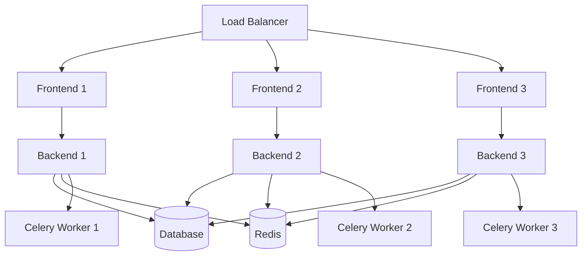

# Docker Scaling Procedures and Best Practices

## Overview

This guide provides detailed procedures for scaling the MindCoach application using Docker containers. It covers horizontal scaling, vertical scaling, auto-scaling, and performance optimization strategies.

## Table of Contents

1. [Scaling Fundamentals](#scaling-fundamentals)
2. [Horizontal Scaling](#horizontal-scaling)
3. [Vertical Scaling](#vertical-scaling)
4. [Auto-Scaling](#auto-scaling)
5. [Load Balancing](#load-balancing)
6. [Database Scaling](#database-scaling)
7. [Performance Optimization](#performance-optimization)
8. [Monitoring and Metrics](#monitoring-and-metrics)
9. [Best Practices](#best-practices)

## Scaling Fundamentals

### Understanding Application Architecture



### Scaling Metrics

#### Key Performance Indicators (KPIs)

1. **Response Time**: Target < 200ms for API calls
2. **Throughput**: Requests per second (RPS)
3. **CPU Utilization**: Target < 70% average
4. **Memory Usage**: Target < 80% of available
5. **Database Connections**: Monitor connection pool usage
6. **Queue Length**: Celery task queue depth

#### Scaling Triggers

```bash
# CPU-based scaling
if [ $(docker stats --no-stream --format "{{.CPUPerc}}" backend | sed 's/%//') -gt 70 ]; then
    echo "CPU threshold exceeded - scaling up"
fi

# Memory-based scaling
if [ $(docker stats --no-stream --format "{{.MemPerc}}" backend | sed 's/%//') -gt 80 ]; then
    echo "Memory threshold exceeded - scaling up"
fi

# Response time-based scaling
RESPONSE_TIME=$(curl -o /dev/null -s -w '%{time_total}' http://localhost/api/health)
if (( $(echo "$RESPONSE_TIME > 1.0" | bc -l) )); then
    echo "Response time threshold exceeded - scaling up"
fi
```

## Horizontal Scaling

### Manual Horizontal Scaling

#### Backend Services

```bash
#!/bin/bash
# scale-backend.sh

REPLICAS=${1:-3}

echo "Scaling backend to $REPLICAS replicas..."

# Scale using Docker Compose
docker-compose -f docker-compose.scale.yml up -d --scale backend=$REPLICAS

# Verify scaling
echo "Current backend instances:"
docker-compose -f docker-compose.scale.yml ps backend

# Test load distribution
echo "Testing load distribution..."
for i in {1..10}; do
    curl -s http://localhost/api/health | jq '.server_id'
done
```

#### Celery Workers

```bash
#!/bin/bash
# scale-workers.sh

WORKERS=${1:-5}

echo "Scaling Celery workers to $WORKERS instances..."

# Scale workers
docker-compose -f docker-compose.scale.yml up -d --scale celery-worker=$WORKERS

# Monitor worker status
docker-compose exec celery-worker celery -A app.celery inspect active_queues
```

#### Frontend Services

```bash
#!/bin/bash
# scale-frontend.sh

REPLICAS=${1:-2}

echo "Scaling frontend to $REPLICAS replicas..."

# Scale frontend
docker-compose -f docker-compose.scale.yml up -d --scale frontend=$REPLICAS

# Update load balancer configuration
./scripts/update-nginx-config.sh $REPLICAS
```

### Docker Swarm Scaling

#### Initialize Swarm

```bash
# Initialize Docker Swarm
docker swarm init

# Add worker nodes
docker swarm join-token worker
```

#### Deploy Stack

```yaml
# docker-compose.swarm.yml
version: '3.8'

services:
  backend:
    image: mindcoach/backend:latest
    deploy:
      replicas: 3
      update_config:
        parallelism: 1
        delay: 10s
        failure_action: rollback
      restart_policy:
        condition: on-failure
        delay: 5s
        max_attempts: 3
      resources:
        limits:
          cpus: '1.0'
          memory: 1G
        reservations:
          cpus: '0.5'
          memory: 512M
    networks:
      - mindcoach-network

  celery-worker:
    image: mindcoach/backend:latest
    command: celery -A app.celery worker --loglevel=info --concurrency=4
    deploy:
      replicas: 5
      resources:
        limits:
          cpus: '1.0'
          memory: 1G
        reservations:
          cpus: '0.25'
          memory: 256M
    networks:
      - mindcoach-network

networks:
  mindcoach-network:
    driver: overlay
```

```bash
# Deploy stack
docker stack deploy -c docker-compose.swarm.yml mindcoach

# Scale services
docker service scale mindcoach_backend=5
docker service scale mindcoach_celery-worker=8
```

### Kubernetes Scaling

#### Deployment Configuration

```yaml
# k8s-deployment.yaml
apiVersion: apps/v1
kind: Deployment
metadata:
  name: mindcoach-backend
spec:
  replicas: 3
  selector:
    matchLabels:
      app: mindcoach-backend
  template:
    metadata:
      labels:
        app: mindcoach-backend
    spec:
      containers:
      - name: backend
        image: mindcoach/backend:latest
        ports:
        - containerPort: 5000
        resources:
          requests:
            memory: "512Mi"
            cpu: "500m"
          limits:
            memory: "1Gi"
            cpu: "1000m"
        env:
        - name: DATABASE_URL
          valueFrom:
            secretKeyRef:
              name: mindcoach-secrets
              key: database-url
---
apiVersion: v1
kind: Service
metadata:
  name: mindcoach-backend-service
spec:
  selector:
    app: mindcoach-backend
  ports:
  - port: 80
    targetPort: 5000
  type: LoadBalancer
---
apiVersion: autoscaling/v2
kind: HorizontalPodAutoscaler
metadata:
  name: mindcoach-backend-hpa
spec:
  scaleTargetRef:
    apiVersion: apps/v1
    kind: Deployment
    name: mindcoach-backend
  minReplicas: 3
  maxReplicas: 10
  metrics:
  - type: Resource
    resource:
      name: cpu
      target:
        type: Utilization
        averageUtilization: 70
  - type: Resource
    resource:
      name: memory
      target:
        type: Utilization
        averageUtilization: 80
```

```bash
# Apply Kubernetes configuration
kubectl apply -f k8s-deployment.yaml

# Manual scaling
kubectl scale deployment mindcoach-backend --replicas=5

# Check scaling status
kubectl get hpa
kubectl get pods
```

## Vertical Scaling

### Resource Optimization

#### Memory Scaling

```yaml
# Increase memory limits
services:
  backend:
    deploy:
      resources:
        limits:
          memory: 4G  # Increased from 2G
        reservations:
          memory: 2G  # Increased from 1G
```

#### CPU Scaling

```yaml
# Increase CPU limits
services:
  backend:
    deploy:
      resources:
        limits:
          cpus: '2.0'  # Increased from 1.0
        reservations:
          cpus: '1.0'  # Increased from 0.5
```

#### Dynamic Resource Adjustment

```bash
#!/bin/bash
# adjust-resources.sh

SERVICE=$1
MEMORY=$2
CPU=$3

# Update container resources
docker update --memory=$MEMORY --cpus=$CPU $(docker ps -q --filter name=$SERVICE)

# Verify changes
docker inspect $(docker ps -q --filter name=$SERVICE) | grep -A 10 "Resources"
```

## Auto-Scaling

### Custom Auto-Scaler

```python
#!/usr/bin/env python3
# autoscaler.py

import docker
import time
import requests
import logging
from datetime import datetime

class AutoScaler:
    def __init__(self):
        self.client = docker.from_env()
        self.min_replicas = 2
        self.max_replicas = 10
        self.scale_up_threshold = 70  # CPU percentage
        self.scale_down_threshold = 30
        self.check_interval = 60  # seconds
        
    def get_service_metrics(self, service_name):
        """Get CPU and memory metrics for a service"""
        containers = self.client.containers.list(
            filters={'name': service_name}
        )
        
        if not containers:
            return None
            
        total_cpu = 0
        total_memory = 0
        
        for container in containers:
            stats = container.stats(stream=False)
            
            # Calculate CPU percentage
            cpu_delta = stats['cpu_stats']['cpu_usage']['total_usage'] - \
                       stats['precpu_stats']['cpu_usage']['total_usage']
            system_delta = stats['cpu_stats']['system_cpu_usage'] - \
                          stats['precpu_stats']['system_cpu_usage']
            
            if system_delta > 0:
                cpu_percent = (cpu_delta / system_delta) * 100
                total_cpu += cpu_percent
                
            # Calculate memory percentage
            memory_usage = stats['memory_stats']['usage']
            memory_limit = stats['memory_stats']['limit']
            memory_percent = (memory_usage / memory_limit) * 100
            total_memory += memory_percent
            
        return {
            'cpu_percent': total_cpu / len(containers),
            'memory_percent': total_memory / len(containers),
            'replica_count': len(containers)
        }
        
    def scale_service(self, service_name, target_replicas):
        """Scale a service to target replica count"""
        try:
            # Use docker-compose to scale
            import subprocess
            result = subprocess.run([
                'docker-compose', '-f', 'docker-compose.scale.yml',
                'up', '-d', '--scale', f'{service_name}={target_replicas}'
            ], capture_output=True, text=True)
            
            if result.returncode == 0:
                logging.info(f"Scaled {service_name} to {target_replicas} replicas")
                return True
            else:
                logging.error(f"Failed to scale {service_name}: {result.stderr}")
                return False
                
        except Exception as e:
            logging.error(f"Error scaling {service_name}: {e}")
            return False
            
    def should_scale_up(self, metrics):
        """Determine if service should scale up"""
        return (metrics['cpu_percent'] > self.scale_up_threshold and 
                metrics['replica_count'] < self.max_replicas)
                
    def should_scale_down(self, metrics):
        """Determine if service should scale down"""
        return (metrics['cpu_percent'] < self.scale_down_threshold and 
                metrics['replica_count'] > self.min_replicas)
                
    def run(self):
        """Main auto-scaling loop"""
        logging.info("Starting auto-scaler...")
        
        while True:
            try:
                # Check backend service metrics
                metrics = self.get_service_metrics('backend')
                
                if metrics:
                    logging.info(f"Backend metrics: CPU={metrics['cpu_percent']:.1f}%, "
                               f"Memory={metrics['memory_percent']:.1f}%, "
                               f"Replicas={metrics['replica_count']}")
                    
                    if self.should_scale_up(metrics):
                        new_replicas = min(metrics['replica_count'] + 1, self.max_replicas)
                        self.scale_service('backend', new_replicas)
                        
                    elif self.should_scale_down(metrics):
                        new_replicas = max(metrics['replica_count'] - 1, self.min_replicas)
                        self.scale_service('backend', new_replicas)
                        
                time.sleep(self.check_interval)
                
            except KeyboardInterrupt:
                logging.info("Auto-scaler stopped")
                break
            except Exception as e:
                logging.error(f"Auto-scaler error: {e}")
                time.sleep(self.check_interval)

if __name__ == "__main__":
    logging.basicConfig(level=logging.INFO)
    scaler = AutoScaler()
    scaler.run()
```

### Prometheus-Based Auto-Scaling

```yaml
# prometheus-autoscaler.yml
apiVersion: v1
kind: ConfigMap
metadata:
  name: autoscaler-config
data:
  config.yaml: |
    rules:
      - name: backend-cpu-scale-up
        query: avg(rate(container_cpu_usage_seconds_total{name="backend"}[5m])) * 100 > 70
        action: scale_up
        service: backend
        max_replicas: 10
        
      - name: backend-cpu-scale-down
        query: avg(rate(container_cpu_usage_seconds_total{name="backend"}[5m])) * 100 < 30
        action: scale_down
        service: backend
        min_replicas: 2
```

## Load Balancing### HAP
roxy Configuration

```haproxy
# haproxy.cfg
global
    daemon
    maxconn 4096
    log stdout local0

defaults
    mode http
    timeout connect 5000ms
    timeout client 50000ms
    timeout server 50000ms
    option httplog
    option dontlognull
    option redispatch
    retries 3

frontend http_front
    bind *:80
    bind *:443 ssl crt /etc/ssl/certs/mindcoach.pem
    redirect scheme https if !{ ssl_fc }
    
    # Health check endpoint
    acl health_check path_beg /health
    use_backend health_backend if health_check
    
    default_backend http_back

backend http_back
    balance roundrobin
    option httpchk GET /api/health
    http-check expect status 200
    
    # Dynamic server registration
    server-template backend 1-10 backend:5000 check resolvers docker init-addr none
    
backend health_backend
    server health 127.0.0.1:8404

listen stats
    bind *:8404
    stats enable
    stats uri /stats
    stats refresh 30s
    stats admin if TRUE
```

### Nginx Load Balancing

```nginx
# nginx.conf
upstream backend_servers {
    least_conn;
    server backend_1:5000 max_fails=3 fail_timeout=30s;
    server backend_2:5000 max_fails=3 fail_timeout=30s;
    server backend_3:5000 max_fails=3 fail_timeout=30s;
    
    # Health check
    keepalive 32;
}

server {
    listen 80;
    server_name mindcoach.com;
    
    location /api/ {
        proxy_pass http://backend_servers;
        proxy_set_header Host $host;
        proxy_set_header X-Real-IP $remote_addr;
        proxy_set_header X-Forwarded-For $proxy_add_x_forwarded_for;
        proxy_set_header X-Forwarded-Proto $scheme;
        
        # Health check
        proxy_next_upstream error timeout invalid_header http_500 http_502 http_503;
        proxy_connect_timeout 5s;
        proxy_send_timeout 10s;
        proxy_read_timeout 10s;
    }
    
    location / {
        root /usr/share/nginx/html;
        try_files $uri $uri/ /index.html;
    }
}
```

### Dynamic Load Balancer Updates

```bash
#!/bin/bash
# update-load-balancer.sh

SERVICE_NAME=$1
REPLICA_COUNT=$2

echo "Updating load balancer for $SERVICE_NAME with $REPLICA_COUNT replicas"

# Generate HAProxy backend configuration
cat > /tmp/haproxy-backend.cfg << EOF
backend http_back
    balance roundrobin
    option httpchk GET /api/health
    http-check expect status 200
EOF

# Add server entries for each replica
for i in $(seq 1 $REPLICA_COUNT); do
    echo "    server ${SERVICE_NAME}_${i} ${SERVICE_NAME}_${i}:5000 check" >> /tmp/haproxy-backend.cfg
done

# Update HAProxy configuration
docker exec haproxy-container cp /tmp/haproxy-backend.cfg /usr/local/etc/haproxy/backend.cfg
docker exec haproxy-container kill -HUP 1  # Reload configuration

echo "Load balancer updated successfully"
```

## Database Scaling

### Read Replicas

```yaml
# docker-compose.db-scale.yml
services:
  postgres-master:
    image: postgres:15-alpine
    environment:
      - POSTGRES_DB=mindcoach
      - POSTGRES_USER=postgres
      - POSTGRES_PASSWORD=${POSTGRES_PASSWORD}
      - POSTGRES_REPLICATION_USER=replicator
      - POSTGRES_REPLICATION_PASSWORD=${REPLICATION_PASSWORD}
    volumes:
      - postgres-master-data:/var/lib/postgresql/data
      - ./postgres/master.conf:/etc/postgresql/postgresql.conf
    command: postgres -c config_file=/etc/postgresql/postgresql.conf

  postgres-replica-1:
    image: postgres:15-alpine
    environment:
      - PGUSER=postgres
      - POSTGRES_PASSWORD=${POSTGRES_PASSWORD}
      - POSTGRES_MASTER_SERVICE=postgres-master
      - POSTGRES_REPLICATION_USER=replicator
      - POSTGRES_REPLICATION_PASSWORD=${REPLICATION_PASSWORD}
    volumes:
      - postgres-replica-1-data:/var/lib/postgresql/data
    command: |
      bash -c "
      until pg_basebackup -h postgres-master -D /var/lib/postgresql/data -U replicator -v -P -W
      do
        echo 'Waiting for master to be ready...'
        sleep 1s
      done
      echo 'standby_mode = on' >> /var/lib/postgresql/data/recovery.conf
      echo 'primary_conninfo = host=postgres-master port=5432 user=replicator' >> /var/lib/postgresql/data/recovery.conf
      postgres
      "
    depends_on:
      - postgres-master
```

### Connection Pooling

```python
# database.py
from sqlalchemy import create_engine
from sqlalchemy.pool import QueuePool
import os

# Master database for writes
master_engine = create_engine(
    os.getenv('DATABASE_MASTER_URL'),
    poolclass=QueuePool,
    pool_size=20,
    max_overflow=30,
    pool_pre_ping=True,
    pool_recycle=3600
)

# Read replica for reads
replica_engine = create_engine(
    os.getenv('DATABASE_REPLICA_URL'),
    poolclass=QueuePool,
    pool_size=15,
    max_overflow=25,
    pool_pre_ping=True,
    pool_recycle=3600
)

class DatabaseRouter:
    def get_engine(self, operation='read'):
        if operation == 'write':
            return master_engine
        else:
            return replica_engine
```

### Database Sharding

```python
# sharding.py
import hashlib

class DatabaseShard:
    def __init__(self):
        self.shards = {
            'shard_1': create_engine(os.getenv('DATABASE_SHARD_1_URL')),
            'shard_2': create_engine(os.getenv('DATABASE_SHARD_2_URL')),
            'shard_3': create_engine(os.getenv('DATABASE_SHARD_3_URL')),
        }
    
    def get_shard(self, user_id):
        """Route user to appropriate shard based on user_id hash"""
        shard_key = int(hashlib.md5(user_id.encode()).hexdigest(), 16) % len(self.shards)
        shard_name = f'shard_{shard_key + 1}'
        return self.shards[shard_name]
    
    def execute_query(self, user_id, query):
        engine = self.get_shard(user_id)
        with engine.connect() as conn:
            return conn.execute(query)
```

## Performance Optimization

### Application-Level Optimizations

#### Caching Strategy

```python
# caching.py
from flask_caching import Cache
import redis

# Redis cache configuration
cache = Cache(config={
    'CACHE_TYPE': 'redis',
    'CACHE_REDIS_URL': 'redis://redis:6379/0',
    'CACHE_DEFAULT_TIMEOUT': 300
})

# Multi-level caching
class MultiLevelCache:
    def __init__(self):
        self.l1_cache = {}  # In-memory cache
        self.l2_cache = redis.Redis(host='redis', port=6379, db=1)  # Redis cache
    
    def get(self, key):
        # Try L1 cache first
        if key in self.l1_cache:
            return self.l1_cache[key]
        
        # Try L2 cache
        value = self.l2_cache.get(key)
        if value:
            # Populate L1 cache
            self.l1_cache[key] = value
            return value
        
        return None
    
    def set(self, key, value, timeout=300):
        # Set in both caches
        self.l1_cache[key] = value
        self.l2_cache.setex(key, timeout, value)

# Cache decorators
@cache.memoize(timeout=600)
def get_user_lessons(user_id):
    # Expensive database query
    return query_user_lessons(user_id)

@cache.cached(timeout=300, key_prefix='subject_list')
def get_available_subjects():
    # Cache subject list
    return query_subjects()
```

#### Database Query Optimization

```python
# query_optimization.py
from sqlalchemy.orm import joinedload, selectinload

# Eager loading to reduce N+1 queries
def get_user_with_lessons(user_id):
    return session.query(User)\
        .options(joinedload(User.lessons))\
        .filter(User.id == user_id)\
        .first()

# Batch loading
def get_multiple_users_with_lessons(user_ids):
    return session.query(User)\
        .options(selectinload(User.lessons))\
        .filter(User.id.in_(user_ids))\
        .all()

# Query result caching
from sqlalchemy_utils import QueryCache

query_cache = QueryCache()

def cached_query(query):
    return query_cache.get_or_create(query)
```

#### Asynchronous Processing

```python
# async_processing.py
import asyncio
import aiohttp
from celery import Celery

# Celery for background tasks
celery = Celery('mindcoach')

@celery.task
def generate_lesson_content(user_id, subject):
    # Long-running task
    content = ai_service.generate_content(user_id, subject)
    save_lesson_content(user_id, subject, content)
    return content

# Async HTTP requests
async def fetch_multiple_apis(urls):
    async with aiohttp.ClientSession() as session:
        tasks = [fetch_url(session, url) for url in urls]
        results = await asyncio.gather(*tasks)
        return results

async def fetch_url(session, url):
    async with session.get(url) as response:
        return await response.json()
```

### Container-Level Optimizations

#### Multi-Stage Builds

```dockerfile
# Dockerfile.optimized
# Build stage
FROM python:3.11-slim as builder

WORKDIR /app

# Install build dependencies
RUN apt-get update && apt-get install -y \
    gcc \
    g++ \
    && rm -rf /var/lib/apt/lists/*

# Install Python dependencies
COPY requirements.txt .
RUN pip install --no-cache-dir --user -r requirements.txt

# Production stage
FROM python:3.11-slim

# Create non-root user
RUN addgroup --system --gid 1001 appgroup && \
    adduser --system --uid 1001 --gid 1001 appuser

WORKDIR /app

# Copy Python packages from builder stage
COPY --from=builder /root/.local /home/appuser/.local

# Copy application code
COPY --chown=appuser:appgroup . .

# Switch to non-root user
USER appuser

# Set PATH to include user packages
ENV PATH=/home/appuser/.local/bin:$PATH

CMD ["python", "run.py"]
```

#### Resource Limits and Requests

```yaml
# Optimized resource configuration
services:
  backend:
    deploy:
      resources:
        limits:
          cpus: '2.0'
          memory: 2G
        reservations:
          cpus: '1.0'
          memory: 1G
    environment:
      - PYTHONUNBUFFERED=1
      - PYTHONDONTWRITEBYTECODE=1
    ulimits:
      nofile:
        soft: 65536
        hard: 65536
```

## Monitoring and Metrics

### Prometheus Metrics

```python
# metrics.py
from prometheus_client import Counter, Histogram, Gauge, generate_latest

# Define metrics
REQUEST_COUNT = Counter('http_requests_total', 'Total HTTP requests', ['method', 'endpoint'])
REQUEST_DURATION = Histogram('http_request_duration_seconds', 'HTTP request duration')
ACTIVE_CONNECTIONS = Gauge('active_database_connections', 'Active database connections')
QUEUE_SIZE = Gauge('celery_queue_size', 'Celery queue size', ['queue'])

# Middleware to collect metrics
@app.before_request
def before_request():
    request.start_time = time.time()

@app.after_request
def after_request(response):
    REQUEST_COUNT.labels(method=request.method, endpoint=request.endpoint).inc()
    REQUEST_DURATION.observe(time.time() - request.start_time)
    return response

# Database connection monitoring
def update_db_metrics():
    active_connections = get_active_db_connections()
    ACTIVE_CONNECTIONS.set(active_connections)

# Celery queue monitoring
def update_queue_metrics():
    for queue_name in ['default', 'content_generation']:
        queue_size = get_queue_size(queue_name)
        QUEUE_SIZE.labels(queue=queue_name).set(queue_size)

# Metrics endpoint
@app.route('/metrics')
def metrics():
    update_db_metrics()
    update_queue_metrics()
    return generate_latest()
```

### Grafana Dashboards

```json
{
  "dashboard": {
    "title": "MindCoach Scaling Dashboard",
    "panels": [
      {
        "title": "Request Rate",
        "type": "graph",
        "targets": [
          {
            "expr": "rate(http_requests_total[5m])",
            "legendFormat": "{{method}} {{endpoint}}"
          }
        ]
      },
      {
        "title": "Response Time",
        "type": "graph",
        "targets": [
          {
            "expr": "histogram_quantile(0.95, rate(http_request_duration_seconds_bucket[5m]))",
            "legendFormat": "95th percentile"
          }
        ]
      },
      {
        "title": "Container CPU Usage",
        "type": "graph",
        "targets": [
          {
            "expr": "rate(container_cpu_usage_seconds_total{name=~\"backend.*\"}[5m]) * 100",
            "legendFormat": "{{name}}"
          }
        ]
      },
      {
        "title": "Container Memory Usage",
        "type": "graph",
        "targets": [
          {
            "expr": "container_memory_usage_bytes{name=~\"backend.*\"} / container_spec_memory_limit_bytes * 100",
            "legendFormat": "{{name}}"
          }
        ]
      }
    ]
  }
}
```

### Alerting Rules

```yaml
# alerting-rules.yml
groups:
  - name: scaling_alerts
    rules:
      - alert: HighCPUUsage
        expr: avg(rate(container_cpu_usage_seconds_total{name="backend"}[5m])) * 100 > 80
        for: 5m
        labels:
          severity: warning
        annotations:
          summary: "High CPU usage detected"
          description: "Backend CPU usage is above 80% for 5 minutes"
          
      - alert: HighMemoryUsage
        expr: avg(container_memory_usage_bytes{name="backend"} / container_spec_memory_limit_bytes) * 100 > 85
        for: 5m
        labels:
          severity: warning
        annotations:
          summary: "High memory usage detected"
          description: "Backend memory usage is above 85% for 5 minutes"
          
      - alert: HighResponseTime
        expr: histogram_quantile(0.95, rate(http_request_duration_seconds_bucket[5m])) > 2
        for: 5m
        labels:
          severity: critical
        annotations:
          summary: "High response time detected"
          description: "95th percentile response time is above 2 seconds"
```

## Best Practices

### Scaling Best Practices

1. **Gradual Scaling**: Scale incrementally to avoid overwhelming the system
2. **Health Checks**: Implement comprehensive health checks for all services
3. **Circuit Breakers**: Use circuit breakers to prevent cascade failures
4. **Graceful Degradation**: Design services to degrade gracefully under load
5. **Resource Monitoring**: Continuously monitor resource usage and performance

### Performance Best Practices

1. **Connection Pooling**: Use connection pooling for databases and external services
2. **Caching Strategy**: Implement multi-level caching (memory, Redis, CDN)
3. **Async Processing**: Use asynchronous processing for long-running tasks
4. **Database Optimization**: Optimize queries and use appropriate indexes
5. **Content Delivery**: Use CDN for static content delivery

### Security Best Practices

1. **Network Segmentation**: Isolate services using Docker networks
2. **Least Privilege**: Run containers with minimal required permissions
3. **Secrets Management**: Use proper secrets management for sensitive data
4. **Regular Updates**: Keep base images and dependencies updated
5. **Security Scanning**: Regularly scan images for vulnerabilities

### Operational Best Practices

1. **Infrastructure as Code**: Use Docker Compose/Kubernetes for reproducible deployments
2. **Automated Testing**: Implement comprehensive testing for scaled environments
3. **Monitoring and Alerting**: Set up comprehensive monitoring and alerting
4. **Backup and Recovery**: Implement robust backup and recovery procedures
5. **Documentation**: Maintain up-to-date scaling procedures and runbooks

---

This scaling guide provides comprehensive procedures for scaling the MindCoach application. Regular review and updates of scaling strategies ensure optimal performance as the application grows.