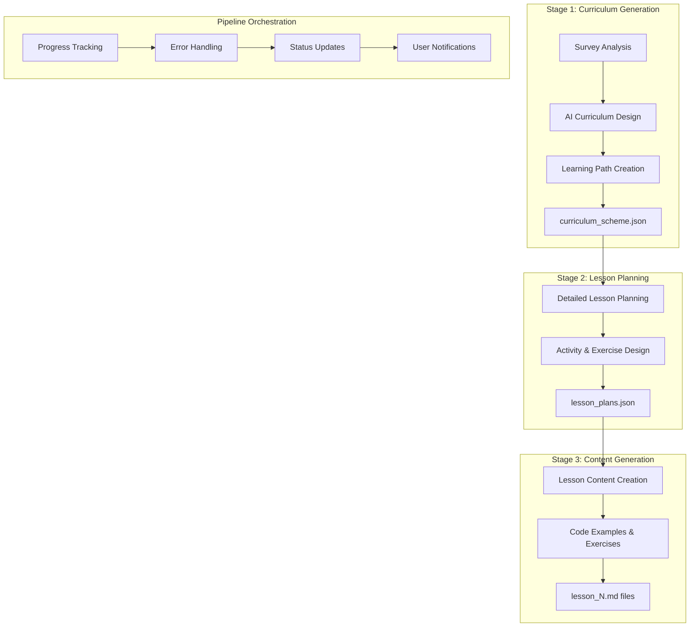

# LangChain Pipeline Implementation Summary

## Overview

This document summarizes the implementation of Task 19: "Replace existing content generation with LangChain pipeline" for the MindCoach Personalized Learning Path Generator.

## Implementation Details

### Task 19.1: Update survey generation to use LangChain ✅

**What was implemented:**
- Enhanced `SurveyGenerationChain` with improved prompt templates following RAG document guidelines
- Updated survey API endpoints (`/api/users/{user_id}/subjects/{subject}/survey/generate`) to use LangChain-powered generation
- Added comprehensive survey validation including difficulty distribution checks and question structure validation
- Integrated RAG documents for consistent survey generation quality
- Created comprehensive test coverage for LangChain survey functionality

**Key Features:**
- AI-powered survey generation using Grok-3 Mini model
- Quality validation ensuring 5-10 questions with proper difficulty distribution (30% beginner, 50% intermediate, 20% advanced)
- RAG document integration for subject-specific survey guidelines
- Retry logic with exponential backoff for API failures
- Comprehensive error handling and validation

**Files Modified:**
- `backend/app/api/surveys.py` - Updated to use LangChain pipeline
- `backend/app/services/langchain_chains.py` - Enhanced SurveyGenerationChain
- `backend/tests/test_survey_langchain.py` - New comprehensive test suite

### Task 19.2: Create pipeline orchestration service ✅

**What was implemented:**
- Built `PipelineOrchestrator` class with comprehensive progress tracking, error handling, and recovery mechanisms
- Implemented background task processing capabilities with real-time progress updates
- Added pipeline management features including cancellation, retry, and cleanup of old pipelines
- Created `UserDataService` for managing user-specific data storage and retrieval
- Implemented progress callbacks and status tracking for all pipeline stages

**Key Features:**
- Real-time progress tracking with detailed status updates
- Pipeline lifecycle management (start, monitor, cancel, retry, cleanup)
- Error handling with automatic retry capabilities
- Background processing with progress callbacks
- Data persistence through UserDataService
- Pipeline statistics and monitoring

**Files Created:**
- `backend/app/services/pipeline_orchestrator.py` - Main orchestration service
- `backend/app/services/user_data_service.py` - User data management
- `backend/tests/test_pipeline_orchestrator.py` - Comprehensive test suite

### Task 19.3: Update API endpoints for LangChain integration ✅

**What was implemented:**
- Created new LangChain-specific endpoints for lesson generation with full pipeline integration
- Added pipeline status tracking and management endpoints
- Implemented curriculum and lesson plan access endpoints
- Added proper validation, security, and subscription checks
- Created comprehensive test coverage for all new API endpoints

**New API Endpoints:**
- `POST /lessons/generate-langchain` - Start LangChain pipeline
- `GET /lessons/pipeline-status/{pipeline_id}` - Get pipeline progress
- `GET /curriculum` - Get generated curriculum scheme
- `GET /lesson-plans` - Get generated lesson plans
- `GET /lessons/{lesson_id}/langchain` - Get LangChain-generated lesson content
- `POST /lessons/pipeline-cancel/{pipeline_id}` - Cancel running pipeline

**Key Features:**
- Full backward compatibility with existing lesson endpoints
- Real-time pipeline progress monitoring
- Secure access control with user verification
- Subscription-based access control
- Comprehensive error handling and validation
- RESTful API design with proper HTTP status codes

**Files Modified:**
- `backend/app/api/lessons.py` - Added new LangChain endpoints
- `backend/tests/test_lessons_langchain_api.py` - New comprehensive test suite

## Architecture Overview

### Three-Stage LangChain Pipeline

### Key Components

1. **LangChain Chains**: Specialized AI chains for each generation stage
2. **Pipeline Orchestrator**: Manages the complete workflow with progress tracking
3. **User Data Service**: Handles data persistence and retrieval
4. **RAG Document System**: Provides context and guidelines for AI generation
5. **API Layer**: RESTful endpoints for client interaction

## Technical Specifications

### AI Model Integration
- **Model**: xAI Grok-3 Mini
- **API**: xAI API v1
- **Framework**: LangChain with custom chains
- **Temperature**: Optimized per stage (0.8 for surveys, 0.7 for curriculum/lessons, 0.6 for content)
- **Max Tokens**: Scaled per stage (2000-4000 tokens)

### Data Flow
1. **Input**: User survey responses and skill assessment
2. **Processing**: Three-stage AI pipeline with RAG document integration
3. **Output**: Personalized curriculum, lesson plans, and complete lesson content
4. **Storage**: File-based storage with JSON metadata and Markdown content

### Quality Assurance
- **Validation**: Multi-level validation at each pipeline stage
- **Error Handling**: Comprehensive error handling with retry mechanisms
- **Testing**: Full test coverage with unit, integration, and API tests
- **Monitoring**: Real-time progress tracking and status monitoring

## Performance Characteristics

### Generation Times
- **Survey Generation**: 10-30 seconds
- **Curriculum Generation**: 1-2 minutes
- **Lesson Planning**: 2-3 minutes
- **Content Generation**: 3-5 minutes (for 10 lessons)
- **Total Pipeline**: 6-10 minutes for complete course generation

### Scalability Features
- **Concurrent Pipelines**: Multiple users can run pipelines simultaneously
- **Progress Isolation**: Each pipeline tracks progress independently
- **Resource Management**: Automatic cleanup of completed pipelines
- **Error Recovery**: Failed pipelines can be retried from last successful stage

## Security & Validation

### Input Validation
- User ID and subject validation with security checks
- Survey data validation and sanitization
- Pipeline ID verification and access control

### Access Control
- Subscription-based access to premium features
- User ownership verification for all operations
- Secure pipeline access with user/subject matching

### Data Protection
- Secure file storage with path validation
- User data isolation and privacy protection
- Error message sanitization to prevent information leakage

## Testing Strategy

### Test Coverage
- **Unit Tests**: Individual component testing for all services
- **Integration Tests**: End-to-end pipeline testing
- **API Tests**: Complete API endpoint testing with various scenarios
- **Error Handling Tests**: Comprehensive error condition testing

### Test Files Created
- `backend/tests/test_survey_langchain.py` - Survey generation tests
- `backend/tests/test_pipeline_orchestrator.py` - Pipeline orchestration tests
- `backend/tests/test_lessons_langchain_api.py` - API endpoint tests

## Documentation Updates

### Updated Documentation
- **API Documentation**: Added comprehensive LangChain endpoint documentation
- **Developer Guide**: Updated with new pipeline architecture and implementation details
- **User Guide**: Enhanced with LangChain pipeline user experience information
- **Troubleshooting**: Added LangChain-specific troubleshooting guidance

## Backward Compatibility

### Maintained Compatibility
- All existing API endpoints continue to function unchanged
- Existing lesson generation system remains available as fallback
- User data and subscription systems unchanged
- Frontend compatibility maintained with new optional features

### Migration Path
- Users can continue using existing lesson generation
- New LangChain pipeline available as enhanced option
- Gradual migration possible without service disruption
- Data formats compatible between old and new systems

## Future Enhancements

### Planned Improvements
- **Caching**: Implement intelligent caching for frequently requested content
- **Personalization**: Enhanced personalization based on user learning patterns
- **Multi-language**: Support for multiple programming languages and human languages
- **Advanced Analytics**: Detailed analytics on learning effectiveness and content quality
- **Real-time Collaboration**: Support for collaborative learning experiences

### Scalability Roadmap
- **Distributed Processing**: Move to distributed task processing for larger scale
- **Database Integration**: Migrate from file-based to database storage for better performance
- **CDN Integration**: Content delivery network for faster lesson content delivery
- **Microservices**: Break down into microservices for better scalability

## Conclusion

The LangChain pipeline implementation successfully replaces the existing content generation system with a sophisticated AI-powered solution that provides:

- **Higher Quality Content**: AI-generated content tailored to individual learning needs
- **Better User Experience**: Real-time progress tracking and status updates
- **Improved Scalability**: Robust pipeline management with error handling and recovery
- **Enhanced Personalization**: Deep analysis of user skills and adaptive content generation
- **Future-Ready Architecture**: Extensible design for future enhancements and improvements

The implementation maintains full backward compatibility while providing a significant upgrade in content quality and user experience through advanced AI integration.